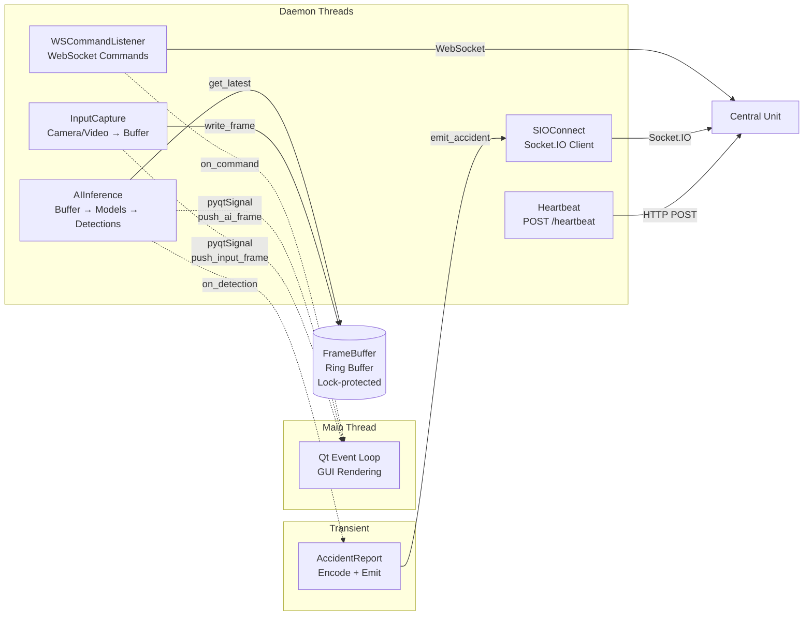
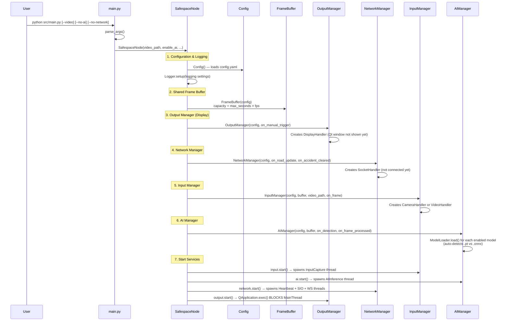
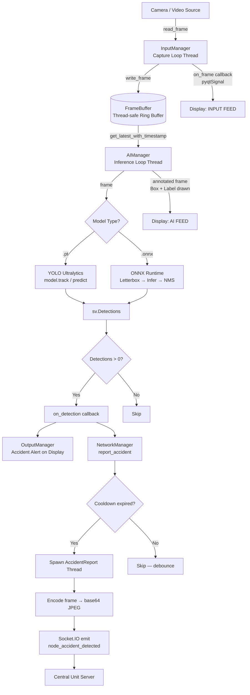
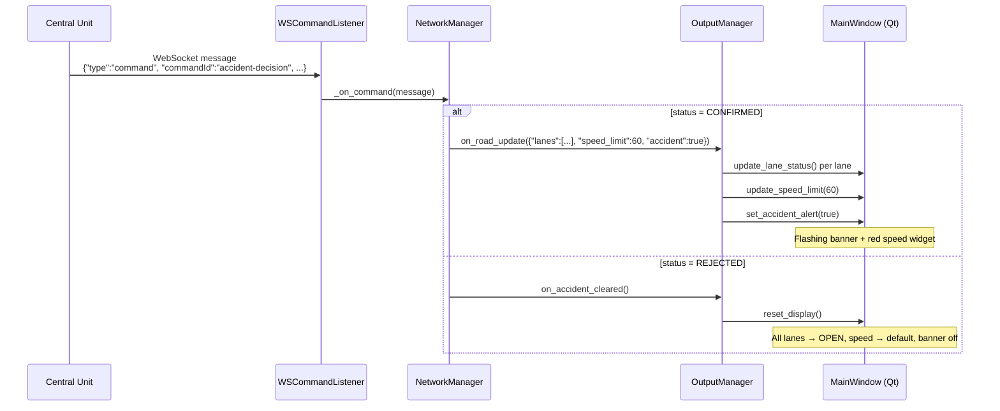
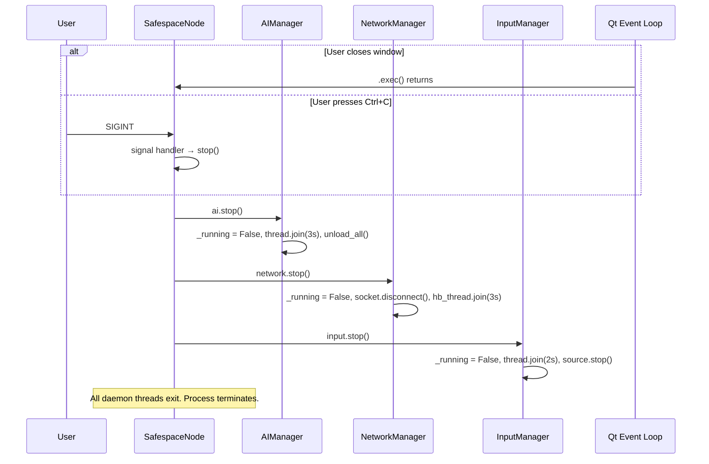
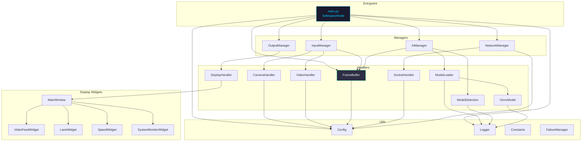

# Safespace Node — Architecture & Engineering Guide

> **Auto-generated analysis** of the Safespace Node codebase.
> Covers threading model, data-flow walkthrough, optimisation plan, and performance risks.

---

## Table of Contents

1. [Thread Map — What Runs When You Launch](#1-thread-map)
2. [Full Application Walkthrough](#2-full-application-walkthrough)
3. [Optimisation Plan](#3-optimisation-plan)
4. [Performance Risks & Fixes](#4-performance-risks--fixes)
5. [Dependency Graph](#5-dependency-graph)
6. [Configuration Reference](#6-configuration-reference)

---

## 1. Thread Map

When you launch the app with **all features enabled** (`python src/main.py --video test.mp4`), the following threads are alive:

| # | Thread Name | Source | Daemon | Purpose |
|---|-------------|--------|--------|---------|
| 1 | **MainThread** | Python + Qt | No | Runs the **Qt event loop** (`QApplication.exec()`). All GUI rendering happens here — signals from other threads are marshalled onto this thread via `pyqtSignal`. Also handles `SIGINT`/`SIGTERM`. |
| 2 | **InputCapture** | `InputManager._capture_loop` | Yes | Reads frames from the camera/video source at the configured FPS (default 30). Writes each frame into the `FrameBuffer` and fires the `on_frame` callback (pushes raw frame to display). |
| 3 | **AIInference** | `AIManager._inference_loop` | Yes | Pulls the latest frame from the `FrameBuffer`, runs every loaded model (YOLO / ONNX), fires `on_detection` and `on_frame_processed` callbacks. Runs as fast as inference allows — naturally drops frames. |
| 4 | **Heartbeat** | `NetworkManager._heartbeat_loop` | Yes | POSTs `/api/nodes/heartbeat` every N seconds (default 5). Gathers CPU, memory, temperature, disk, and FPS metrics via `psutil`. |
| 5 | **SIOConnect** | `SocketHandler._connect_sio` | Yes | Connects the Socket.IO client. After connection, the `python-socketio` library manages its own internal I/O thread for event processing. |
| 6 | **WSCommandListener** | `SocketHandler._start_ws` → `ws.run_forever` | Yes | Runs the raw WebSocket event loop (`websocket-client`). Receives commands from the Central Unit (e.g. accident-decision). Auto-reconnects with exponential backoff on disconnect. |
| 7 | **AccidentReport** *(transient)* | `NetworkManager.report_accident` | Yes | Spawned on-demand when an accident is detected. Encodes the frame as base64 JPEG, builds the payload, and emits via Socket.IO. Destroyed after the HTTP round-trip completes. |

### Thread Count Summary

| Scenario | Steady-State Threads | Notes |
|----------|---------------------|-------|
| Full launch (display + AI + network) | **6** | Threads 1–6 above |
| `--no-network` | **3** | MainThread + InputCapture + AIInference |
| `--no-ai --no-network` | **2** | MainThread + InputCapture |
| `--no-display --no-network` | **2** | MainThread (headless loop) + InputCapture + AIInference (3 total) |
| During accident report | **+1 transient** | AccidentReport thread (short-lived) |

### Thread Interaction Diagram



---

## 2. Full Application Walkthrough

### 2.1 Startup Sequence



### 2.2 Frame Processing Pipeline



### 2.3 Server Command Flow (Accident Decision)



### 2.4 Shutdown Sequence



---

## 3. Optimisation Plan

### 3.1 High Priority — Inference Performance

| # | Area | Current Behaviour | Proposed Optimisation | Expected Impact |
|---|------|-------------------|----------------------|-----------------|
| 1 | **GIL contention** | All threads (capture, inference, display callbacks) compete for the Python GIL. YOLO inference in particular holds the GIL during pre/post-processing. | Move the AI inference loop to a **separate process** using `multiprocessing` with a shared frame queue (`multiprocessing.Queue` or shared memory). The ONNX/YOLO process releases the GIL during C-level inference but still holds it during NumPy pre/post-processing. | **+30-50% throughput** on multi-core CPUs. Capture and display no longer stall during inference. |
| 2 | **Frame copy overhead** | `FrameBuffer.get_latest_with_timestamp()` returns `entry.frame.copy()`. The AI loop immediately gets this copy, then copies it again for annotation (`frame.copy()`). A 640×640×3 frame = ~1.2 MB per copy. | Use **shared memory** (`multiprocessing.shared_memory`) or a zero-copy ring buffer (pre-allocated NumPy array with index tracking). Alternatively, only copy when `on_frame_processed` is active. | **-2 frame-copies per inference cycle** (~2.4 MB/cycle saved). |
| 3 | **ONNX preprocessing** | Letterbox + BGR→RGB + transpose + normalize done with pure NumPy every frame. | Pre-allocate the output buffer. If resolution is fixed (common), cache the letterbox padding and resize parameters. Optionally use `cv2.dnn.blobFromImage` which is faster (single C call for resize+normalize+transpose). | **~20-40% faster preprocessing** per frame. |
| 4 | **Model warm-up** | First inference is ~10× slower (ONNX session optimization, YOLO graph compilation). | Add a **warm-up pass** after loading each model: run inference once on a dummy frame before starting the loop. | Eliminates first-frame latency spike. |

### 3.2 Medium Priority — Display & I/O

| # | Area | Current Behaviour | Proposed Optimisation | Expected Impact |
|---|------|-------------------|----------------------|-----------------|
| 5 | **Frame signal flood** | Every captured frame fires `push_input_frame_signal.emit(frame)`. At 30 FPS, Qt processes 30 pixmap conversions/second on the main thread. The AI feed adds another stream. | Implement **frame decimation** for the display: only emit every Nth frame (e.g. every 2nd = 15 FPS display). The human eye can't tell the difference at 15+ FPS for monitoring. Alternatively, use a `QTimer`-based pull model instead of push. | **~50% reduction in Qt main-thread load**. Display remains smooth. |
| 6 | **BGR→RGB conversion** | `cv2.cvtColor(frame, cv2.COLOR_BGR2RGB)` runs on the Qt main thread inside `VideoFeedWidget.push_frame()`. | Move color conversion to the producer side (InputCapture or AIInference thread) before emitting the signal, or use `QImage.Format_BGR888` (Qt 6.2+) to skip conversion entirely. | Removes a per-frame OpenCV call from the GUI thread. |
| 7 | **Heartbeat sleep granularity** | `_heartbeat_loop` sleeps in 0.1s increments (`for _ in range(interval * 10): sleep(0.1)`). | Replace with `threading.Event.wait(timeout=interval)`. The event can be set on shutdown for instant wake-up, and the code is simpler. | Cleaner shutdown, lower overhead. |
| 8 | **System monitor polling** | `SystemMonitorWidget` calls `psutil.cpu_percent(interval=None)` every 1 second. `NetworkManager._get_health_metrics()` does the same. | Share a single `psutil` sampling thread/timer and distribute results to both consumers via a callback or shared dict. | Avoids duplicate `psutil` calls. |

### 3.3 Lower Priority — Code Quality & Maintainability

| # | Area | Proposed Change |
|---|------|-----------------|
| 9 | **Type safety** | Replace `Dict[str, Any]` model registry with a `@dataclass` (e.g. `LoadedModel(model, type, path, confidence, target_classes)`). Improves IDE support and catches key-name typos. |
| 10 | **Protocol / ABC for models** | Define a `ModelProtocol` (Python `Protocol` class) with `.names`, `.input_shape` so type checkers can verify ONNX vs YOLO compatibility at development time. |
| 11 | **Configurable NMS threshold** | `ModelDetection._NMS_IOU_THRESHOLD` is hardcoded to 0.45. Expose it in `config.yaml` per model (like `confidence`). |
| 12 | **Graceful model hot-reload** | Currently no way to swap models without restarting. Add a `reload_model(name)` method to `AIManager`. |
| 13 | **Structured logging** | Switch to structured JSON logging (`python-json-logger`) for easier parsing by monitoring tools. |
| 14 | **Metrics / Observability** | Add FPS counters to AIManager (inference FPS vs. camera FPS). Expose them in heartbeat and display. |

---

## 4. Performance Risks & Fixes

### Risk 1 — Python GIL Bottleneck (CRITICAL)

**Problem:** Python's Global Interpreter Lock means only one thread runs Python bytecode at a time. When the AI inference thread is doing NumPy preprocessing or postprocessing (Python-level), the InputCapture thread blocks, causing frame drops. Similarly, heavy Qt signal processing stalls on the main thread.

**Evidence:** All three hot paths (capture, inference, display) are Python-bound threads sharing the GIL.

**Fix:**
```
Short-term:  Use model.predict(frame, half=True) for FP16 inference (less GIL time in C-level code).
             Use `cv2.dnn.blobFromImage` instead of manual NumPy preprocessing.
Medium-term: Move AIManager into a subprocess via multiprocessing.Process.
             Communicate frames via multiprocessing.shared_memory.
             Communicate detections back via a multiprocessing.Queue.
Long-term:   Consider using asyncio for I/O-bound tasks (heartbeat, socket)
             and keep only compute in threads/processes.
```

### Risk 2 — Unbounded Frame Signal Queue (HIGH)

**Problem:** `push_input_frame_signal.emit(frame)` and `push_ai_frame_signal.emit(frame)` push frames into Qt's event queue. If the Qt main thread can't process frames fast enough (e.g., during accident banner flash animation), frames queue up in memory. Each 640×640×3 frame is ~1.2 MB. At 30 FPS, a 1-second stall = 36 MB of accumulated frames.

**Evidence:** No backpressure mechanism. Signals are fire-and-forget.

**Fix:**
```python
# Use an atomic "latest frame" holder instead of queuing every frame.
# In InputManager / AIManager, store the latest frame:
self._latest_display_frame = frame  # atomic reference swap

# In Qt, pull on a QTimer instead of being pushed:
self._display_timer = QTimer()
self._display_timer.timeout.connect(self._pull_and_render)
self._display_timer.start(33)  # ~30 FPS

def _pull_and_render(self):
    frame = self._source.get_latest_display_frame()  # just reads the reference
    if frame is not None:
        self.video_widget.push_frame(frame)
```

### Risk 3 — FrameBuffer Lock Contention (MEDIUM)

**Problem:** `FrameBuffer` uses a single `threading.Lock` for both `write_frame()` (InputCapture thread) and `get_latest_with_timestamp()` (AIInference thread). If inference is slow, the AI thread holds the lock while copying a frame, blocking the InputCapture thread from writing.

**Evidence:** `get_latest_with_timestamp()` calls `entry.frame.copy()` inside the lock.

**Fix:**
```python
# Option A: Use threading.RLock + minimize critical section
def get_latest_with_timestamp(self):
    with self._lock:
        if not self._buffer:
            return None
        entry = self._buffer[-1]
        frame_ref = entry.frame       # just grab the reference (fast)
        ts = entry.timestamp
    return frame_ref.copy(), ts        # copy OUTSIDE the lock

# Option B: Lock-free design with a double-buffer or numpy shared memory
```

### Risk 4 — Memory Leak from Transient AccidentReport Threads (MEDIUM)

**Problem:** `NetworkManager.report_accident()` spawns a new `threading.Thread` for every accident detection that passes the cooldown. If the Socket.IO connection is down, `emit_accident()` blocks on timeout (default 10s). Multiple AI detections during that window could spawn many threads, each holding a full frame in memory.

**Evidence:** No thread pool or limit on concurrent AccidentReport threads.

**Fix:**
```python
# Use a single-threaded executor with a queue:
from concurrent.futures import ThreadPoolExecutor

self._report_executor = ThreadPoolExecutor(max_workers=1, thread_name_prefix="AccidentReport")

def report_accident(self, detections, frame):
    if cooldown_expired:
        self._report_executor.submit(self._send_accident_report, detections, frame)
```

### Risk 5 — No Frame Timestamping from Source (LOW)

**Problem:** `TimestampedFrame.timestamp` is set to `time.time()` when `write_frame()` is called — not when the frame was actually captured by the camera. If the InputCapture thread is delayed (GIL, I/O), timestamps skew. This can cause the AI inference loop to incorrectly skip frames (it compares timestamps).

**Fix:**
```python
# Capture timestamp at read time:
def _capture_loop(self):
    frame = self.source.read_frame()
    ts = time.time()  # timestamp at capture, not at buffer-write
    self.buffer.write_frame(frame, timestamp=ts)
```

### Risk 6 — Display StyleSheet Churn (LOW)

**Problem:** `SystemMonitorWidget._sample()` re-applies the **entire** QSS stylesheet on every sample tick (every 1s) based on CPU load. `LaneWidget.set_status()` also re-applies stylesheets for child elements on every call. Repeated `setStyleSheet()` calls trigger Qt's CSS parsing engine, which is expensive.

**Fix:**
```python
# Cache the last applied style and skip if unchanged:
def _sample(self):
    cpu = psutil.cpu_percent(interval=None)
    new_color = "#ff4444" if cpu > 80 else "#ffa500" if cpu > 50 else "#00ff88"
    if new_color != self._last_chunk_color:
        self._last_chunk_color = new_color
        self._cpu_bar.setStyleSheet(...)  # only when value changes
```

---

## 5. Dependency Graph



---

## 6. Configuration Reference

Quick reference for all `config.yaml` keys and which component reads them:

| Key | Type | Default | Consumer |
|-----|------|---------|----------|
| `node.id` | str | `"safe-space-node-001"` | NetworkManager, SocketHandler |
| `node.location.lat / long` | str | `"30.0444"` / `"31.2357"` | NetworkManager (accident payload) |
| `node.lanes` | int | `4` | OutputManager, MainWindow, NetworkManager |
| `node.default_speed` | int | `120` | OutputManager, MainWindow |
| `camera.model` | str | `"native"` | SafespaceNode, CameraHandler |
| `camera.resolution.width / height` | int | `640` | CameraHandler, NetworkManager |
| `camera.fps` | int | `30` | InputManager, FrameBuffer |
| `camera.loop_video` | bool | `true` | VideoHandler |
| `buffer.max_seconds` | int | `30` | FrameBuffer |
| `display.mode` | str | `"dev"` | MainWindow (dev vs prod layout) |
| `display.width / height` | int | `1500` / `856` | MainWindow |
| `display.fullscreen` | bool | `false` | DisplayHandler |
| `ai.models.<name>.type` | str | `"yolo"` | AIManager (logging) |
| `ai.models.<name>.path` | str | — | AIManager → ModelLoader |
| `ai.models.<name>.confidence` | float | `0.5` | AIManager → ModelDetection |
| `ai.models.<name>.enabled` | bool | `true` | AIManager |
| `ai.models.<name>.target_classes` | list | `[]` | AIManager → ModelDetection |
| `network.server_url` | str | — | NetworkManager, SocketHandler |
| `network.ws_path` | str | `"/ws/nodes"` | SocketHandler |
| `network.heartbeat_interval` | int | `5` | NetworkManager |
| `network.timeout` | int | `10` | NetworkManager, SocketHandler |
| `network.accident_cooldown` | int | `1` | NetworkManager |
| `logging.level` | str | `"INFO"` | Logger |
| `logging.rotation` | str | `"5MB"` | Logger |
| `logging.backup_count` | int | `5` | Logger |
| `logging.file_logging` | bool | `true` | Logger |
| `failures.threshold` | int | `5` | FailureManager |
| `failures.window_seconds` | int | `300` | FailureManager |
| `failures.auto_reset` | bool | `false` | FailureManager |

---

## 7. File Map

| File | Lines | Responsibility |
|------|-------|---------------|
| `src/main.py` | ~255 | Entrypoint, CLI args, `SafespaceNode` orchestrator |
| `src/managers/ai.py` | ~253 | AI lifecycle, inference loop, model registry |
| `src/managers/input.py` | ~140 | Capture loop, FPS throttling |
| `src/managers/output.py` | ~151 | Display bridge: detection → UI, server → UI |
| `src/managers/network.py` | ~430 | Heartbeat, accident reporting, command dispatch |
| `src/handlers/camera.py` | ~231 | Native / PiCam / IMX500 capture |
| `src/handlers/video.py` | ~90 | Video file playback with loop support |
| `src/handlers/frame_buffer.py` | ~154 | Thread-safe ring buffer (deque + lock) |
| `src/handlers/model_loader.py` | ~102 | Auto-detect & load .pt / .onnx models |
| `src/handlers/model_detection.py` | ~301 | YOLO + ONNX inference paths, NMS, filtering |
| `src/handlers/onnx_model.py` | ~115 | ONNX Runtime session wrapper with metadata extraction |
| `src/handlers/socket.py` | ~254 | Socket.IO + raw WebSocket dual-channel transport |
| `src/handlers/display/` | ~700+ | PyQt6 dashboard (dev/prod modes, widgets) |
| `src/utils/config.py` | ~123 | YAML config loader with dot-notation access |
| `src/utils/logger.py` | ~70 | Rotating file + console logger |
| `src/utils/constants.py` | ~55 | Global constants (paths, statuses, API endpoints) |
| `src/utils/failures.py` | ~90 | Error tracking with threshold-based alerting |
