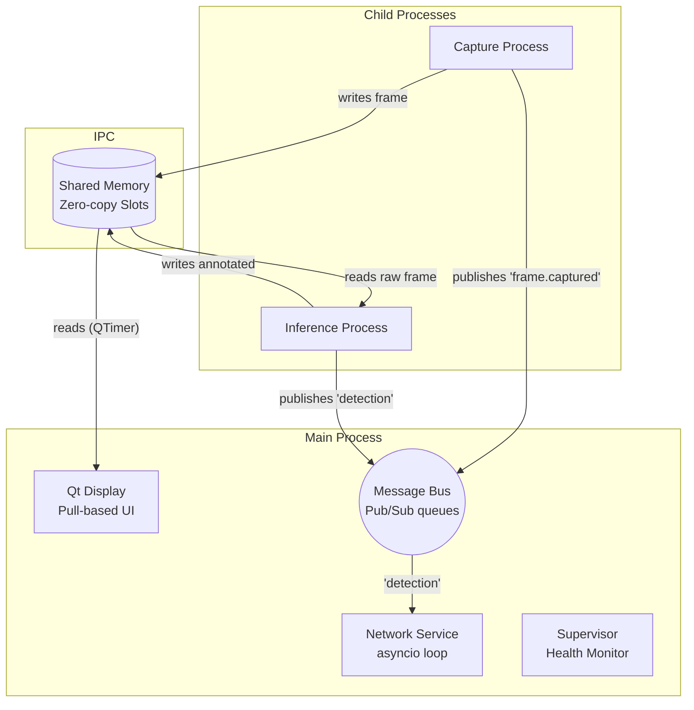

# Safespace Node V2 — Architecture & Engineering Guide

> **V2 Architecture update**: This document details the V2 redesign of Safespace Node, focusing on high-performance multiprocessing, zero-copy memory semantics, and containerized edge deployments.

---

## Table of Contents

1. [Process Map — What Runs When You Launch](#1-process-map)
2. [Data Flow & Shared Memory](#2-data-flow--shared-memory)
3. [Component Breakdown](#3-component-breakdown)
4. [Supervisor & State Machine](#4-supervisor--state-machine)
5. [Docker & Deployment Strategy](#5-docker--deployment-strategy)
6. [Configuration Reference](#6-configuration-reference)

---

## 1. Process Map

To completely bypass the Python Global Interpreter Lock (GIL) and maximize throughput on lower-end hardware (like Raspberry Pi), Safespace Node V2 separates core responsibilities into independent OS processes.

| # | Process / Thread Name | Purpose |
|---|------------------------|---------|
| 1 | **Main Process** | Orchestrates startup, allocates shared memory, and runs the display and network services. |
| 1a | `↳ Qt Event Thread` | Runs the display loop (`QTimer` pulls frames at ~30 FPS). |
| 1b | `↳ NetworkService Thread` | Runs a dedicated `asyncio` event loop for HTTP, Socket.IO, and WebSocket networking. |
| 1c | `↳ Supervisor Thread` | Periodically checks the health of child processes; handles fallback state transitions. |
| 2 | **Capture Process** | Reads frames from the camera/video source. Formats them and writes them directly into the pre-allocated Shared Memory Block. |
| 3 | **Inference Process** | Reads frames from Shared Memory. Runs YOLO/ONNX models. Writes annotated frames back to Shared Memory and publishes detection payloads to the Message Bus. |

### Process Interaction Diagram

---

## 2. Data Flow & Shared Memory

**Problem solved by V2**: In V1, moving frames (1.2MB arrays) between threads required Python-level memory copies (`.copy()`), leading to heavy memory bandwidth usage and lock contention (`FrameBuffer`).

**V2 Solution**:
We utilise `multiprocessing.shared_memory` to pre-allocate a fixed control block and large frame buffers directly into RAM. All processes map this RAM to NumPy array views (`np.ndarray(buffer=shm.buf)`).

1. **Capture**: The camera grabs a frame. We invoke `copyto()` to write it directly into the active Shared Memory slot. No locks are required; atomic pointer swapping is managed within the Shared Memory control block.
2. **Inference**: The AI process reads the NumPy view directly. It runs inference. If bounding boxes are needed, it copies the frame, annotates it, and pushes it to a dedicated 'annotated' slot in Shared Memory.
3. **Display**: The display app uses `QTimer` to wake every 33ms. It checks the latest pointer in the shared control block. If new, it creates a `QImage` referencing the memory.

**This results in true zero-copy reads across the application boundary.**

---

## 3. Component Breakdown

*   `src/core/shared_memory.py`: Creates the memory-mapped byte buffer and atomic lock-free indices using struct packing.
*   `src/core/message_bus.py`: Decouples processes. Uses a set of bounded `multiprocessing.Queue` instances. Incorporates strict drop-policies for slow consumers to prevent system-wide backpressure.
*   `src/capture/`: Houses the input factory (supporting PiCamera, IMX500, and generic OpenCV) and the runner script for the dedicated OS process.
*   `src/inference/`: Wraps `ultralytics` and `onnxruntime`. Pings the Supervisor on the `ai.health_ping` bus topic to prove the loop is unblocked.
*   `src/network/`: Unified Asyncio loop managing `HeartbeatService`, `AccidentReporter` (Socket.IO), `CommandHandler`, and the new `VideoStreamer`.
*   `src/display/`: The PyQt6 display. V2 eliminated push-based events (`pyqtSignal`), resolving the UI event flood that plagued V1.

---

## 4. Supervisor & State Machine

Safespace V2 must be extremely resilient. Edge nodes cannot randomly go offline.

`src/core/node_state.py` defines a finite state machine:
- `NORMAL`: Everything is working. AI runs locally.
- `STREAMING`: Inference has crashed, stalled, or is disabled. The Node actively streams raw MJPEG video over WebSockets to the Central Unit so server-side AI can assume control.
- `DEGRADED`: The local AI is down AND the network is unreachable. The node buffers locally and waits.

The `NodeSupervisor` acts as a watchdog. It expects periodic `ai.health_ping` events. If the AI process halts (e.g. out of memory, or driver crash), the Supervisor terminates the process, attempts a configurable number of restarts, and if it fails, cleanly drops the application into `STREAMING` mode.

---

## 5. Docker & Deployment Strategy

V2 resolves dependency nightmare via a Multi-Stage Dockerfile.

- `target: raspi`: Configured for Raspberry Pi OS (Debian Bookworm) `aarch64`. Installs PyQT6 using apt to sidestep Pip compiling issues.
- `target: gpu`: For NVIDIA-backed instances.
- `target: headless`: Perfect for pure edge deployments (`SAFESPACE_NO_DISPLAY=1`).

The `docker-compose.yml` mounts `/dev/video0` and `/app/configs/config.yaml` as read-only volumes. Environment variable overrides (like `NODE_ID` and `SERVER_URL`) allow for fleet provisioning without file modification.

---

## 6. Configuration Reference

V2 unifies JSON configuration into a single `configs/config.yaml` file with environment variable fallback.

| Key | Example / Default | Description |
|-----|-------------------|-------------|
| `streaming.fps` | `10` | Frame rate for MJPEG fallback streaming. |
| `streaming.quality` | `50` | JPEG compression quality (0-100) to balance bandwidth. |
| `supervisor.max_ai_restarts` | `3` | Allowed attempts to restart a dead AI process before defaulting to STREAMING mode. |
| `buffer.num_slots` | `4` | Number of pre-allocated raw frame slots in shared RAM. |
| `display.mode` | `"dev"` | Toggles UI layouts (`dev` vs `prod`). |
| `network.server_url` | `https://...` | Central unit endpoint. Override via `SERVER_URL`. |
