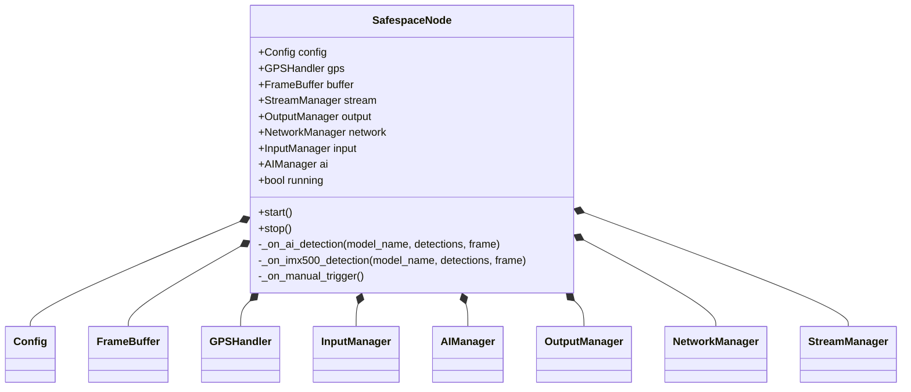
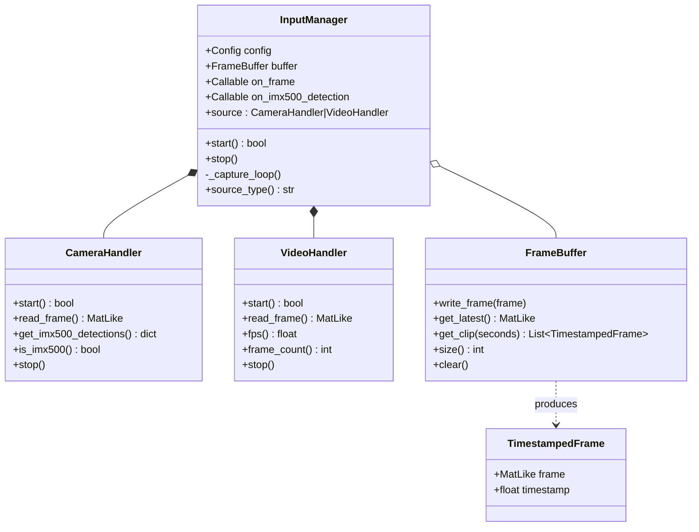
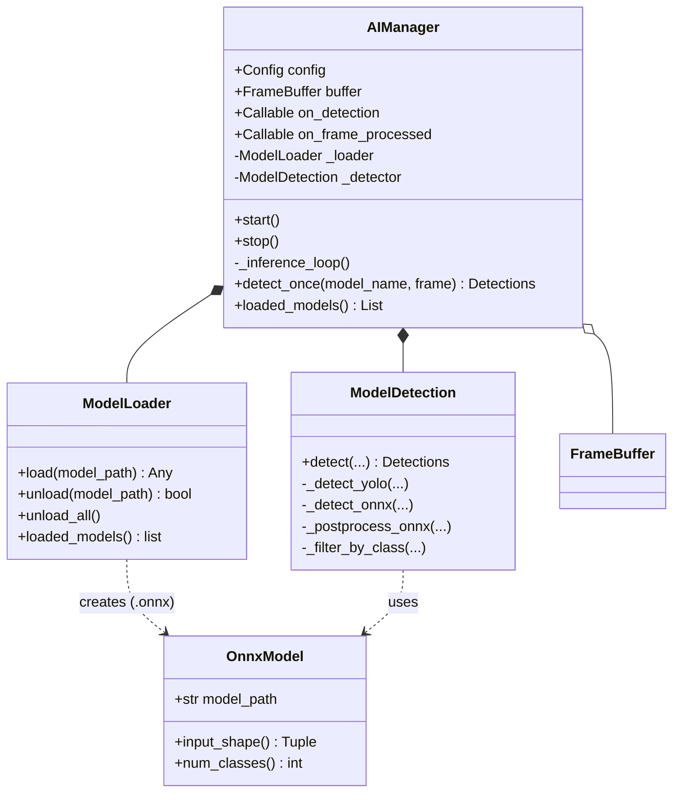
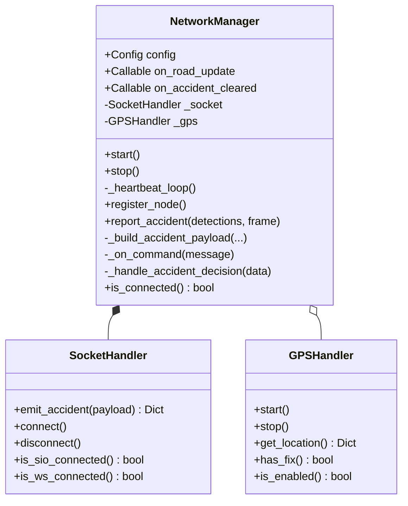
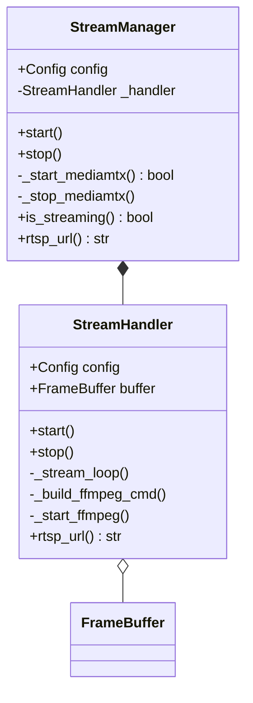
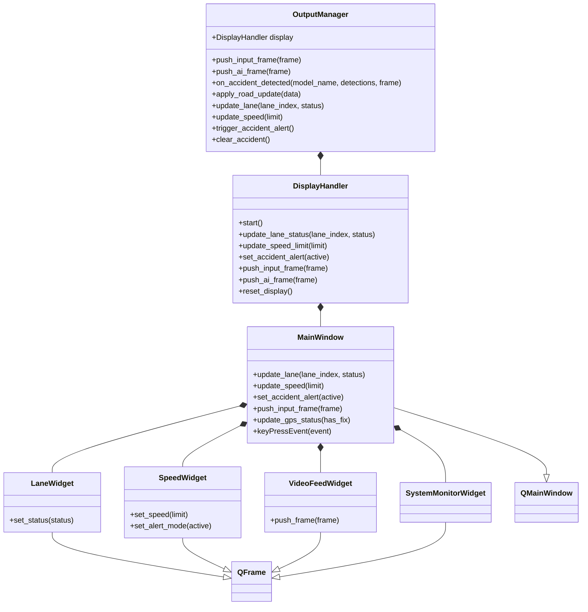
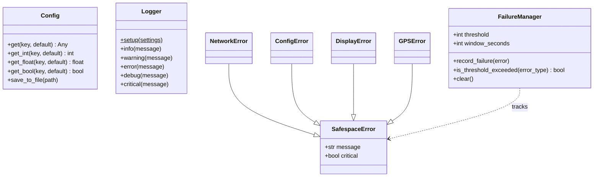

# Safespace Node — Class Diagrams

UML class diagrams split by subsystem. Each diagram stands alone.

Legend:
- `*--` composition (owner creates and owns the part)
- `o--` aggregation (shared/injected reference, created elsewhere)
- `..>` dependency (transient use / creation)
- `--|>` inheritance

---

## 1. Top-Level Orchestration

**Figure X.5.1.** UML class diagram of the Safespace Node top-level orchestration. Composition (filled diamond) links the `SafespaceNode` orchestrator to the `Config`, `FrameBuffer`, `GPSHandler`, and the five subsystem managers it creates and owns for the lifetime of the node.

---

## 2. Input Subsystem (capture)

**Figure X.5.2.** UML class diagram of the input (capture) subsystem. Composition links `InputManager` to its concrete frame source — either a `CameraHandler` or a `VideoHandler` — while aggregation (open diamond) links it to the shared `FrameBuffer`. The buffer produces `TimestampedFrame` records (dependency).

---

## 3. AI / Inference Subsystem

**Figure X.5.3.** UML class diagram of the AI/inference subsystem. Composition links `AIManager` to its `ModelLoader` and `ModelDetection` collaborators, and aggregation links it to the shared `FrameBuffer`. Dependency arrows show `ModelLoader` creating and `ModelDetection` consuming `OnnxModel` instances for `.onnx` weights.

---

## 4. Network Subsystem

**Figure X.5.4.** UML class diagram of the network subsystem. Composition links `NetworkManager` to the `SocketHandler` it owns (Socket.IO + raw WebSocket transport), while aggregation links it to the `GPSHandler` injected after construction for location-tagged heartbeats and accident reports.

---

## 5. Stream Subsystem (RTSP)

**Figure X.5.5.** UML class diagram of the RTSP stream subsystem. Composition links `StreamManager` (which supervises the MediaMTX subprocess) to the `StreamHandler` it owns, and aggregation links the handler to the shared `FrameBuffer` it reads from to feed the `ffmpeg` publisher.

---

## 6. Display / GUI Subsystem

**Figure X.5.6.** UML class diagram of the display/GUI subsystem. Composition links `OutputManager` → `DisplayHandler` → `MainWindow`, which in turn owns the `LaneWidget`, `SpeedWidget`, `VideoFeedWidget`, and `SystemMonitorWidget`. A generalisation tree shows `MainWindow` specialising `QMainWindow` and each widget specialising `QFrame` (PyQt6).

---

## 7. Utilities & Error Hierarchy

**Figure X.5.7.** UML class diagram of the shared utilities and error hierarchy. A generalisation tree models the `SafespaceError` hierarchy (`NetworkError`, `ConfigError`, `DisplayError`, `GPSError`), tracked by `FailureManager` (dependency). `Config` and `Logger` are the cross-cutting configuration and logging utilities used throughout the node.

