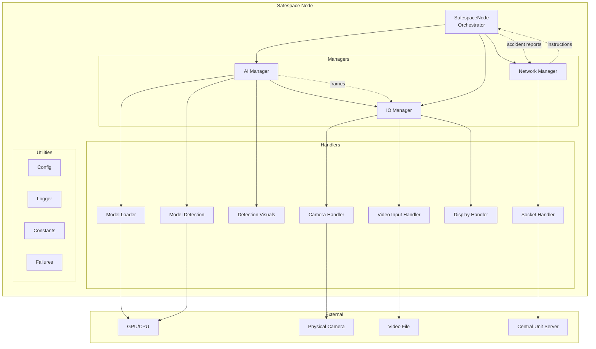
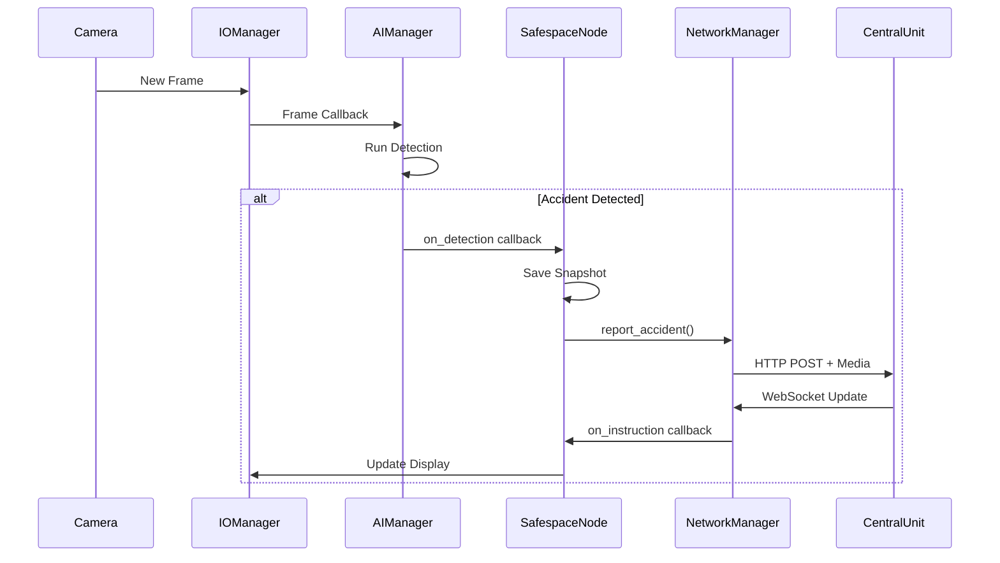

# Safespace Node Documentation

Welcome to the Safespace Node documentation. This document provides a comprehensive overview of the road safety monitoring system architecture, components, and their interactions.

## Table of Contents

1. [Overview](#overview)
2. [Architecture](#architecture)
3. [Getting Started](#getting-started)
4. [Documentation Index](#documentation-index)

---

## Overview

**Safespace Node** is an intelligent road safety monitoring system designed to detect accidents and hazardous conditions on highways. The system uses computer vision and AI to analyze video feeds from roadside cameras, detect incidents, and communicate with a central control unit for coordinated response.

### Key Features

- 🎥 **Real-time Video Processing** - Camera or video file input for testing
- 🤖 **AI-Powered Detection** - YOLO-based accident detection models
- 📡 **Network Communication** - WebSocket-based real-time communication with Central Unit
- 🖥️ **Professional Dashboard** - PyQt6-based highway status display
- 🔄 **Resilient Architecture** - Graceful degradation and failure tracking

---

## Architecture



### Data Flow



---

## Getting Started

### Prerequisites

- Python 3.10+
- PyQt6
- OpenCV
- PyTorch / CUDA (for GPU acceleration)
- Ultralytics YOLO

### Installation

```bash
# Clone the repository
git clone <repository-url>
cd Safespace_node

# Install dependencies
pip install -r requirements.txt

# For GPU support
pip install -r requirements-gpu.txt

# For Raspberry Pi
pip install -r requirements-raspi.txt
```

### Running the Node

```bash
cd safespace

# Standard mode (camera + network)
python main.py

# Video test mode
python main.py --video path/to/test_video.mp4

# Offline mode (no network)
python main.py --offline

# Without AI detection
python main.py --no-ai

# Combined flags
python main.py --video test.mp4 --offline --no-ai
```

---

## Documentation Index

### Handlers
Low-level components that interact with hardware and external services.

| Document | Description |
|----------|-------------|
| [Camera Handler](handlers/camera_handler.md) | Physical camera capture and frame management |
| [Video Input Handler](handlers/video_input_handler.md) | Video file playback for testing |
| [Display Handler](handlers/display_handler.md) | PyQt6 GUI dashboard |
| [Socket Handler](handlers/socket_handler.md) | WebSocket/HTTP communication |
| [Model Loader Handler](handlers/model_loader_handler.md) | YOLO model loading and caching |
| [Model Detection Handler](handlers/model_detection_handler.md) | Object detection inference |
| [Detection Visuals Handler](handlers/detection_visuals_handler.md) | Bounding box visualization |

### Managers
Mid-level orchestrators that coordinate multiple handlers.

| Document | Description |
|----------|-------------|
| [IO Manager](managers/io_manager.md) | Input/Output coordination |
| [AI Manager](managers/ai_manager.md) | AI model lifecycle and detection |
| [Network Manager](managers/network_manager.md) | Network operations and heartbeat |

### Utilities
Shared utility modules used across the application.

| Document | Description |
|----------|-------------|
| [Config](utilities/config.md) | Configuration management |
| [Logger](utilities/logger.md) | Logging infrastructure |
| [Constants](utilities/constants.md) | Global constants and paths |
| [Failures](utilities/failures.md) | Error handling and resilience |

### Core
| Document | Description |
|----------|-------------|
| [Main (SafespaceNode)](core/main.md) | Application entry point and orchestrator |

---

## License

© 2026 Safespace Project. All rights reserved.
