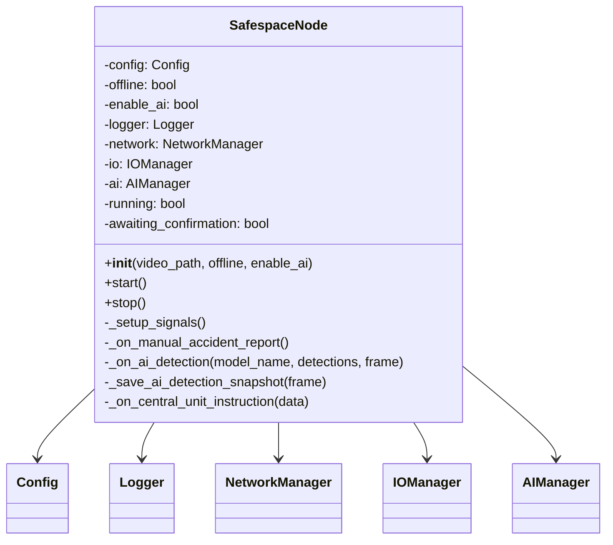
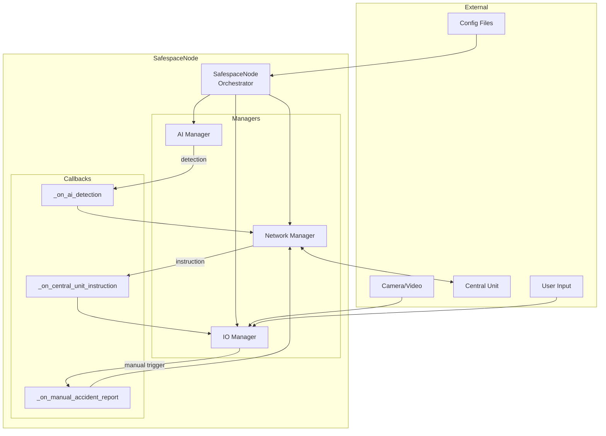
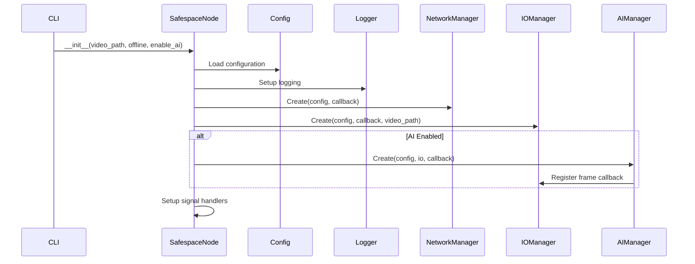
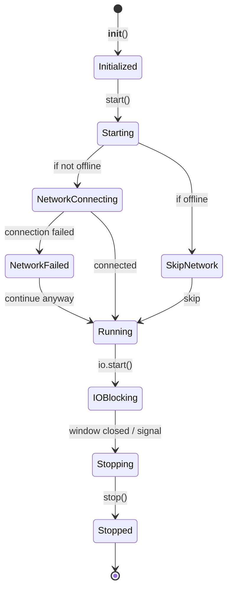
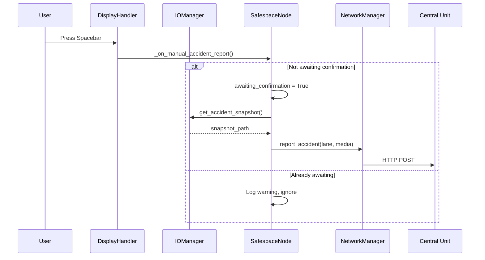
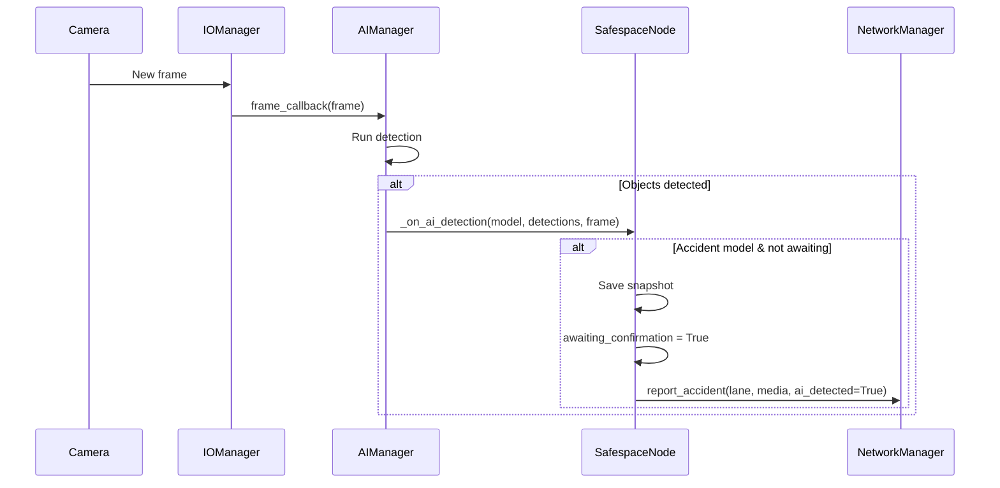
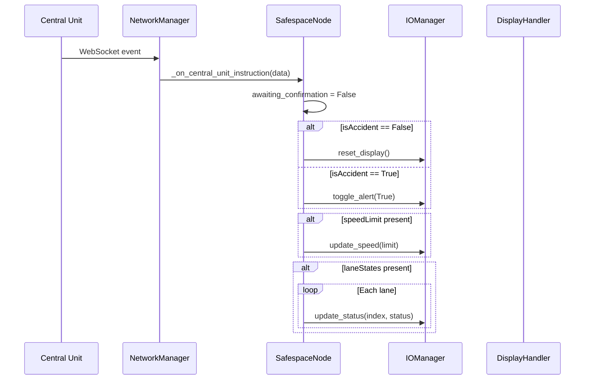
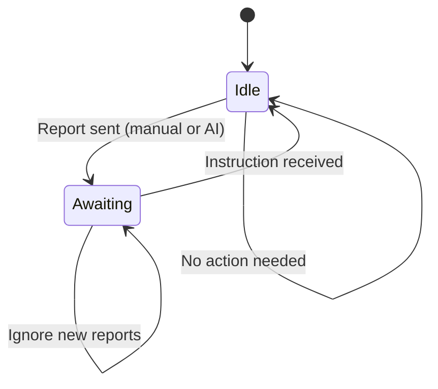
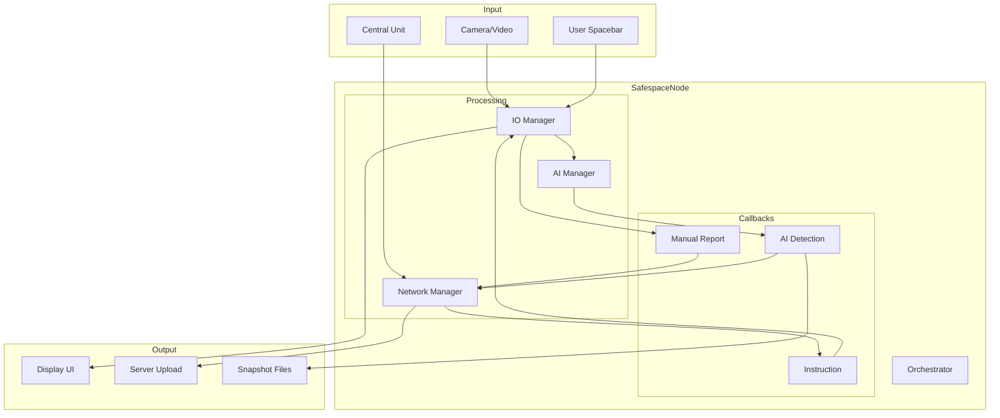

# SafespaceNode (Main Orchestrator)

The SafespaceNode class is the main entry point and orchestrator for the Safespace road safety monitoring system. It coordinates all managers and handles the application lifecycle.

## Overview



## Purpose

The SafespaceNode orchestrator provides:

1. **Initialization** - Load config, setup logging, create managers
2. **Lifecycle Management** - Start/stop all services
3. **Event Routing** - Connect managers via callbacks
4. **Accident Handling** - Process manual and AI-detected incidents
5. **Signal Handling** - Graceful shutdown on SIGINT/SIGTERM

## Architecture



## Command Line Interface

```bash
python main.py [OPTIONS]
```

### Arguments

| Argument | Short | Type | Description |
|----------|-------|------|-------------|
| `--video` | `-v` | string | Path to video file for testing |
| `--offline` | `-o` | flag | Run without network connection |
| `--no-ai` | - | flag | Disable AI detection |

### Examples

```bash
# Standard mode (camera + network + AI)
python main.py

# Video test mode
python main.py --video /path/to/test.mp4

# Offline mode (no network)
python main.py --offline

# Without AI (manual detection only)
python main.py --no-ai

# Combined flags
python main.py -v test.mp4 -o --no-ai
```

## Initialization Flow



## Lifecycle



## API Reference

### Constructor

```python
def __init__(self, video_path: str = None, offline: bool = False, enable_ai: bool = True)
```

**Parameters:**
- `video_path`: Optional path to video file (replaces camera)
- `offline`: Skip network connection if `True`
- `enable_ai`: Initialize AI detection if `True`

### Methods

#### `start()`

Starts all node services.

```python
node = SafespaceNode(video_path="test.mp4")
node.start()  # Blocks until stopped
```

**Sequence:**
1. Connect to network (unless offline)
2. Set `running = True`
3. Start IO manager (blocks on Qt event loop)
4. Stop services on exit

---

#### `stop()`

Cleanly shuts down all services.

```python
node.stop()
```

**Sequence:**
1. Set `running = False`
2. Stop network manager
3. Stop IO manager
4. Log shutdown complete

## Event Handling

### Manual Accident Report



### AI Detection



### Central Unit Instruction



## State Management

### Awaiting Confirmation

The `awaiting_confirmation` flag prevents duplicate reports:



## Signal Handling

```python
def _setup_signals(self):
    def handler(sig, frame):
        self.logger.info("Shutdown signal received")
        self.stop()
    signal.signal(signal.SIGINT, handler)   # Ctrl+C
    signal.signal(signal.SIGTERM, handler)  # kill command
```

## Configuration Requirements

The node requires these configuration files:

| File | Required Keys |
|------|---------------|
| `node.json` | `node.id`, `node.location`, `node.lanes` |
| `network.json` | `network.server_url` |
| `camera.json` | `camera.index`, `camera.fps` |
| `logging.json` | `logging.level` |
| `ai.json` | `ai.models` (if AI enabled) |

## Usage Example

```python
import sys
import os

# Add safespace to path
sys.path.append(os.path.dirname(os.path.abspath(__file__)))

from main import SafespaceNode

# Create node
node = SafespaceNode(
    video_path="/path/to/test.mp4",  # Optional
    offline=False,                    # Connect to server
    enable_ai=True                    # Enable AI detection
)

# Start (blocks)
node.start()

# After window closes or signal received:
# - Network disconnected
# - Camera/video stopped
# - Logs written
```

## Error Handling

| Scenario | Behavior |
|----------|----------|
| Network connection fails | Continue in offline mode |
| Camera fails to start | Continue in display-only mode |
| AI model fails to load | Continue without AI |
| IO runtime error | Log error, trigger stop |
| Signal received | Graceful shutdown |

## Complete Data Flow



## Related Components

- [IO Manager](../managers/io_manager.md) - Input/Output coordination
- [AI Manager](../managers/ai_manager.md) - Detection pipeline
- [Network Manager](../managers/network_manager.md) - Server communication
- [Config](../utilities/config.md) - Configuration loading
- [Logger](../utilities/logger.md) - Logging setup
