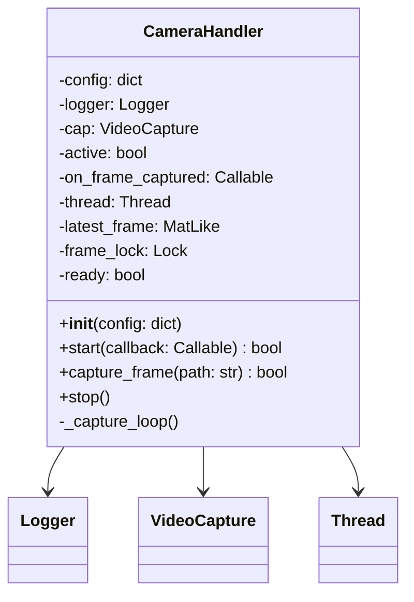
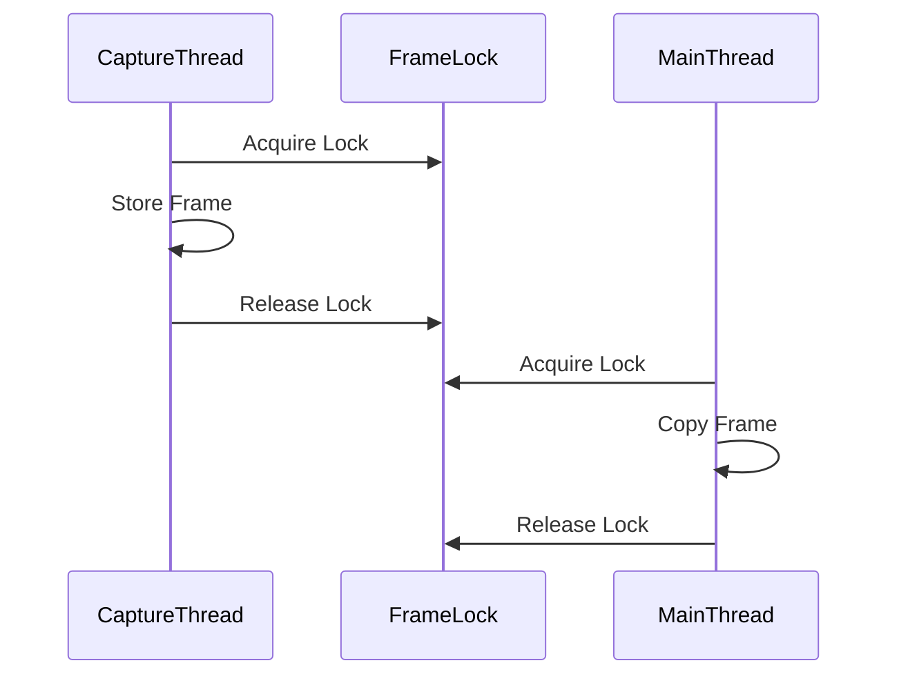
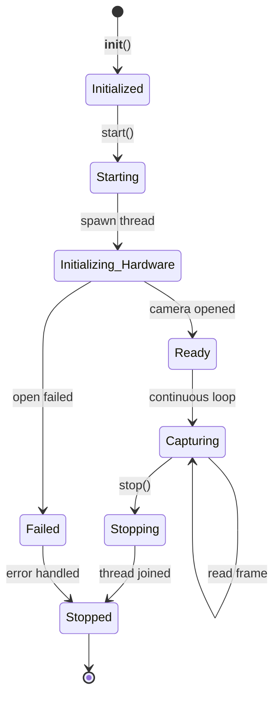
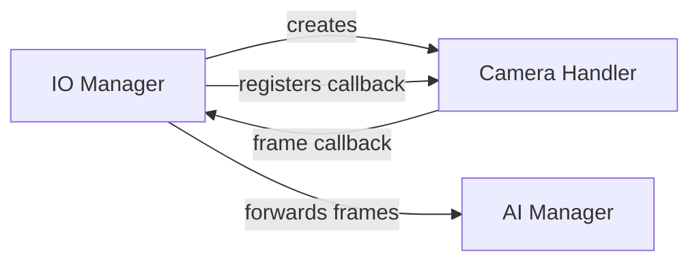

# Camera Handler

The Camera Handler manages low-level frame capture from physical camera hardware using OpenCV. It runs in a dedicated thread to prevent blocking the GUI or AI processing.

## Overview



## Purpose

The Camera Handler serves as the interface between the physical camera hardware and the rest of the application. It:

1. **Initializes camera hardware** in a background thread
2. **Continuously captures frames** at a configurable FPS
3. **Stores the latest frame** for snapshot requests
4. **Notifies subscribers** via callbacks when new frames arrive

## Architecture

```mermaid
flowchart TD
    subgraph "Camera Handler"
        INIT[Initialize Handler]
        START[start()]
        SPAWN[Spawn Capture Thread]
        LOOP[Capture Loop]
        STORE[Store Latest Frame]
        CALLBACK[Invoke Callback]
        STOP[stop()]
    end
    
    subgraph "External"
        HW[Camera Hardware]
        AI[AI Manager]
    end
    
    INIT --> START
    START --> SPAWN
    SPAWN --> LOOP
    LOOP --> |Read Frame| HW
    HW --> STORE
    STORE --> CALLBACK
    CALLBACK --> AI
    STOP --> |Release| HW
    
    LOOP --> |Loop| LOOP
```

## Configuration

The handler accepts the following configuration options (from `camera.json`):

| Key | Type | Default | Description |
|-----|------|---------|-------------|
| `index` | int | 0 | Camera device index |
| `fps` | int | 30 | Target frames per second |
| `width` | int | 640 | Frame width in pixels |
| `height` | int | 480 | Frame height in pixels |

### Example Configuration

```json
{
  "camera": {
    "index": 0,
    "fps": 30,
    "width": 1280,
    "height": 720
  }
}
```

## API Reference

### Constructor

```python
def __init__(self, config: dict)
```

Initializes the camera handler with the given configuration.

**Parameters:**
- `config`: Camera-specific configuration dictionary

### Methods

#### `start(callback: Optional[Callable] = None) -> bool`

Starts the camera capture in a background thread.

```python
def on_frame(frame):
    print(f"Got frame: {frame.shape}")

camera = CameraHandler(config)
camera.start(callback=on_frame)
```

**Parameters:**
- `callback`: Optional function called for each captured frame

**Returns:** `True` if the thread was started successfully

---

#### `capture_frame(path: str) -> bool`

Saves the current frame to disk.

```python
success = camera.capture_frame("/path/to/snapshot.jpg")
```

**Parameters:**
- `path`: Absolute path where the image should be saved

**Returns:** `True` if the frame was saved successfully

---

#### `stop()`

Cleanly stops the camera capture and releases hardware resources.

```python
camera.stop()
```

## Thread Safety

The Camera Handler uses a `threading.Lock` to ensure thread-safe access to the latest frame:



## Lifecycle



## Error Handling

The handler gracefully handles common camera issues:

1. **Camera not found**: Logs error and sets `active = False`
2. **Empty frames**: Logs warning and retries after 100ms delay
3. **Callback errors**: Caught and logged, doesn't crash the capture loop

## Usage Example

```python
from Handlers.Camera_Handler import CameraHandler
from utils.logger import Logger

# Setup
Logger.setup({'level': 'INFO'})

config = {
    'index': 0,
    'fps': 30,
    'width': 1280,
    'height': 720
}

# Define frame callback
def process_frame(frame):
    # This is called in the camera thread
    print(f"Processing frame: {frame.shape}")

# Initialize and start
camera = CameraHandler(config)
camera.start(callback=process_frame)

# ... later, capture a snapshot
camera.capture_frame("/tmp/snapshot.jpg")

# Cleanup
camera.stop()
```

## Integration with IO Manager

The Camera Handler is typically instantiated and managed by the [IO Manager](../managers/io_manager.md):



## Related Components

- [Video Input Handler](video_input_handler.md) - Alternative input for testing
- [IO Manager](../managers/io_manager.md) - Parent orchestrator
- [AI Manager](../managers/ai_manager.md) - Frame consumer
