# Detection Visuals Handler

The Detection Visuals Handler draws bounding boxes and labels on frames to visualize detection results using the Supervision library.

## Overview

```mermaid
classDiagram
    class DetectionVisualsHandler {
        -logger: Logger
        +__init__()
        +visualize_detections(frame, detections) MatLike
    }
    
    DetectionVisualsHandler --> Logger
    DetectionVisualsHandler --> "sv.BoxAnnotator"
```

## Purpose

The Detection Visuals Handler provides:

1. **Bounding Box Rendering** - Draw detection boxes on frames
2. **Label Annotation** - Display class ID and confidence scores
3. **Visual Debugging** - Help verify detection accuracy
4. **Demo Output** - Create annotated frames for presentations

## Architecture


## Visualization Process


## API Reference

### Constructor

```python
def __init__(self)
```

Initializes the visuals handler with a logger instance.

### Methods

#### `visualize_detections(frame: MatLike, detections: sv.Detections) -> MatLike`

Draws bounding boxes and labels on the frame.

```python
handler = DetectionVisualsHandler()
annotated_frame = handler.visualize_detections(frame, detections)
cv2.imshow("Detections", annotated_frame)
```

**Parameters:**
- `frame`: Input image/frame (numpy array)
- `detections`: Supervision Detections object

**Returns:** Annotated frame with bounding boxes and labels

## Box Annotator Configuration

The handler uses Supervision's `BoxAnnotator` with these settings:

| Parameter | Value | Description |
|-----------|-------|-------------|
| `thickness` | 2 | Line thickness for boxes |
| `text_thickness` | 1 | Line thickness for text |
| `text_scale` | 0.5 | Scale factor for text size |

## Label Format

Each detection label shows:
```
{class_id}: {confidence}
```

Example: `0: 0.87` (Class 0 with 87% confidence)

## Visual Output

```mermaid
graph TD
    subgraph "Annotated Frame"
        BOX1[/"🟩 Bounding Box"/]
        LABEL1["0: 0.92"]
        BOX2[/"🟩 Bounding Box"/]
        LABEL2["1: 0.78"]
    end
    
    BOX1 --- LABEL1
    BOX2 --- LABEL2
```



### Example Visualization

```
┌──────────────────────────────────────────┐
│                                          │
│    ┌─────────────────┐                   │
│    │ 0: 0.92         │                   │
│    │                 │                   │
│    │    [Accident]   │                   │
│    │                 │                   │
│    └─────────────────┘                   │
│                                          │
│              ┌──────────┐                │
│              │ 1: 0.78  │                │
│              │ [Vehicle]│                │
│              └──────────┘                │
│                                          │
└──────────────────────────────────────────┘
```

## Usage Example

### Basic Usage

```python
from Handlers.Model_Loader_Handler import ModelLoader
from Handlers.Model_Detection_Handler import ModelDetectionHandler
from Handlers.Detection_Visuals_Handler import DetectionVisualsHandler
import cv2

# Setup
loader = ModelLoader()
model = loader.load_model("AI Layer/Models/Car Accident.pt")
detector = ModelDetectionHandler()
visualizer = DetectionVisualsHandler()

# Process frame
frame = cv2.imread("test_image.jpg")
detections = detector.detect(model, frame, 0.5)

# Visualize
annotated = visualizer.visualize_detections(frame, detections)

# Display
cv2.imshow("Detections", annotated)
cv2.waitKey(0)
```

### Integration with AI Manager

```python
# AI Manager's detect_and_visualize method
def detect_and_visualize(self, model_name: str, frame: MatLike):
    detections = self.detect(model_name, frame)
    if detections is not None and len(detections) > 0:
        frame = self.visuals_handler.visualize_detections(frame, detections)
    return detections, frame
```

## Processing Pipeline


## Performance Considerations

| Operation | Typical Time |
|-----------|--------------|
| Box drawing | < 1 ms |
| Label rendering | < 1 ms |
| Total per frame | 1-3 ms |

The visualization is lightweight and doesn't significantly impact overall performance.

## Customization Options

To customize the visualization, you can modify the `BoxAnnotator` parameters:

```python
# Example with custom settings
box_annotator = sv.BoxAnnotator(
    thickness=4,           # Thicker boxes
    text_thickness=2,      # Bolder text
    text_scale=1.0,        # Larger text
    text_padding=10,       # More padding around text
    text_color=sv.Color.WHITE,
    color=sv.Color.RED     # Box color
)
```

## Label Information

Currently, labels display:
- **Class ID**: Numeric identifier from the model
- **Confidence**: Detection confidence (0.00 - 1.00)

### Class ID Mapping

To display class names instead of IDs, you would need to map IDs to names:

```python
class_names = {
    0: "Accident",
    1: "Vehicle",
    2: "Pedestrian"
}

labels = [
    f"{class_names.get(d.class_id, d.class_id)}: {d.confidence:.2f}"
    for d in detections
]
```

## Related Components

- [Model Detection Handler](model_detection_handler.md) - Generates detections
- [Model Loader Handler](model_loader_handler.md) - Loads detection models
- [AI Manager](../managers/ai_manager.md) - Coordinates visualization
