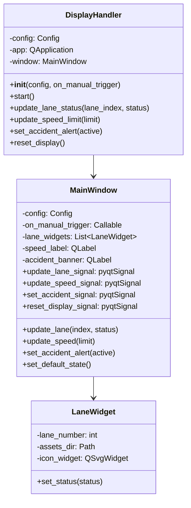
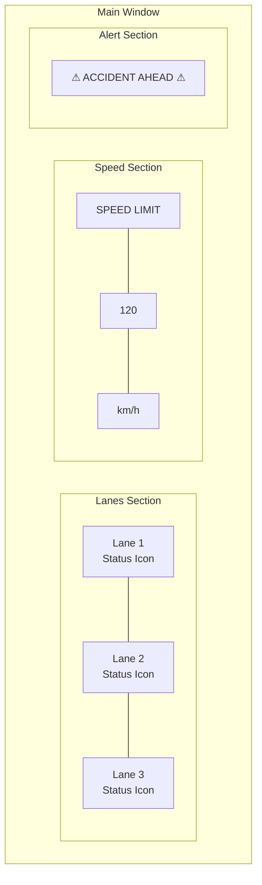
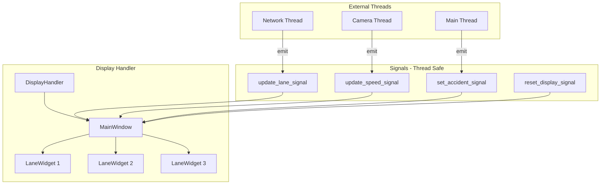
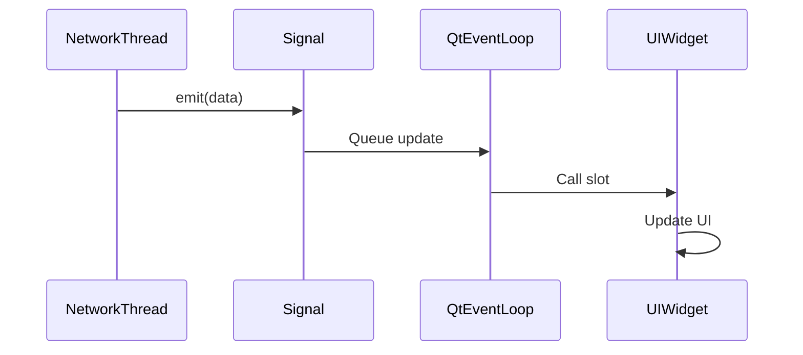
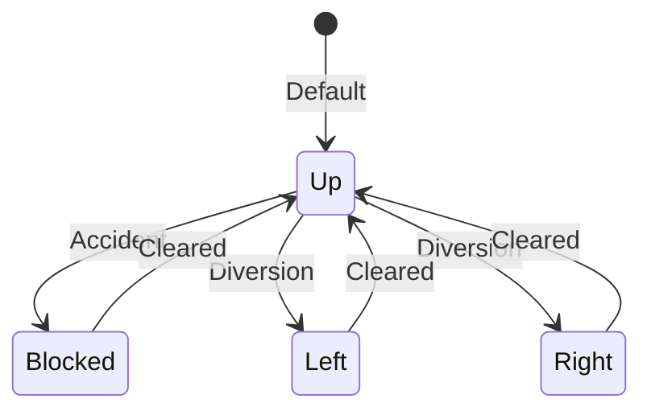
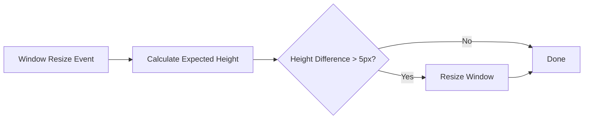

# Display Handler

The Display Handler manages the Safespace Node's graphical user interface using PyQt6, providing a professional dark-themed dashboard for highway status visualization.

## Overview



## Purpose

The Display Handler provides:

1. **Highway Status Dashboard** - Visual representation of lane states
2. **Speed Limit Display** - Current speed limit indicator
3. **Accident Alerts** - High-visibility warning banners
4. **Manual Trigger Interface** - Spacebar-based accident reporting
5. **Thread-Safe Updates** - Safe UI updates from any thread

## UI Layout



## Architecture



## Configuration

| Key | Type | Default | Description |
|-----|------|---------|-------------|
| `display.width` | int | 1500 | Window width in pixels |
| `display.height` | int | 856 | Window height in pixels |
| `node.lanes` | int | 3 | Number of lanes to display |
| `node.default_speed` | int | 120 | Default speed limit |

### Example Configuration

```json
{
  "display": {
    "width": 1920,
    "height": 1080
  },
  "node": {
    "lanes": 3,
    "default_speed": 120
  }
}
```

## API Reference

### DisplayHandler

#### Constructor

```python
def __init__(self, config: Config, on_manual_trigger: Optional[Callable] = None)
```

**Parameters:**
- `config`: Configuration object
- `on_manual_trigger`: Callback function for spacebar press

#### Methods

##### `start()`

Starts the GUI event loop. **This call blocks until the window is closed.**

```python
display = DisplayHandler(config, on_manual_trigger=report_accident)
display.start()  # Blocks here
```

---

##### `update_lane_status(lane_index: int, status: str)`

Updates the status icon for a specific lane.

```python
display.update_lane_status(0, "blocked")
display.update_lane_status(1, "left")
display.update_lane_status(2, "up")
```

**Status Values:**
| Status | Icon | Color |
|--------|------|-------|
| `"up"` | Go Straight | Green |
| `"blocked"` | X | Red |
| `"left"` | Turn Left | Orange |
| `"right"` | Turn Right | Orange |

---

##### `update_speed_limit(limit: int)`

Updates the speed limit display.

```python
display.update_speed_limit(80)
```

---

##### `set_accident_alert(active: bool)`

Shows or hides the accident warning banner.

```python
display.set_accident_alert(True)   # Show warning
display.set_accident_alert(False)  # Hide warning
```

---

##### `reset_display()`

Resets all UI elements to their default state.

```python
display.reset_display()
```

## Thread Safety with Qt Signals

The Display Handler uses PyQt signals to ensure thread-safe UI updates:



### Signal Definitions

```python
class MainWindow(QMainWindow):
    update_lane_signal = pyqtSignal(int, object)  # lane_index, status
    update_speed_signal = pyqtSignal(int)          # speed_limit
    set_accident_signal = pyqtSignal(bool)         # active
    reset_display_signal = pyqtSignal()            # no args
```

## Lane Status Visualization



### Visual Themes

| Status | Background | Border |
|--------|------------|--------|
| Up | `rgba(0, 255, 136, 0.15)` | `rgba(0, 255, 136, 0.6)` |
| Blocked | `rgba(255, 50, 50, 0.15)` | `rgba(255, 50, 50, 0.6)` |
| Left/Right | `rgba(255, 165, 0, 0.15)` | `rgba(255, 165, 0, 0.6)` |

## Keyboard Interaction

The MainWindow captures keyboard events for manual accident reporting:

```python
def keyPressEvent(self, event):
    if event.key() == Qt.Key.Key_Space and self.on_manual_trigger:
        self.on_manual_trigger()
```

## Aspect Ratio Handling

The window maintains a 16:9 aspect ratio on resize:



## Asset Management

Lane icons are loaded from SVG files:

| Status | File |
|--------|------|
| Up | `road_signs_icons/go_straight.svg` |
| Blocked | `road_signs_icons/blocked.svg` |
| Left | `road_signs_icons/turn-left.svg` |
| Right | `road_signs_icons/turn-right.svg` |

## Usage Example

```python
from Handlers.Display_Handler import DisplayHandler
from utils.config import Config

def on_spacebar():
    print("Manual accident report triggered!")

config = Config()
display = DisplayHandler(config, on_manual_trigger=on_spacebar)

# In another thread (before start()):
# display.update_lane_status(0, "blocked")
# display.update_speed_limit(60)
# display.set_accident_alert(True)

display.start()  # Blocks - runs Qt event loop
```

## Related Components

- [IO Manager](../managers/io_manager.md) - Creates and manages Display Handler
- [Network Manager](../managers/network_manager.md) - Triggers display updates
- [Constants](../utilities/constants.md) - Lane status values and paths
