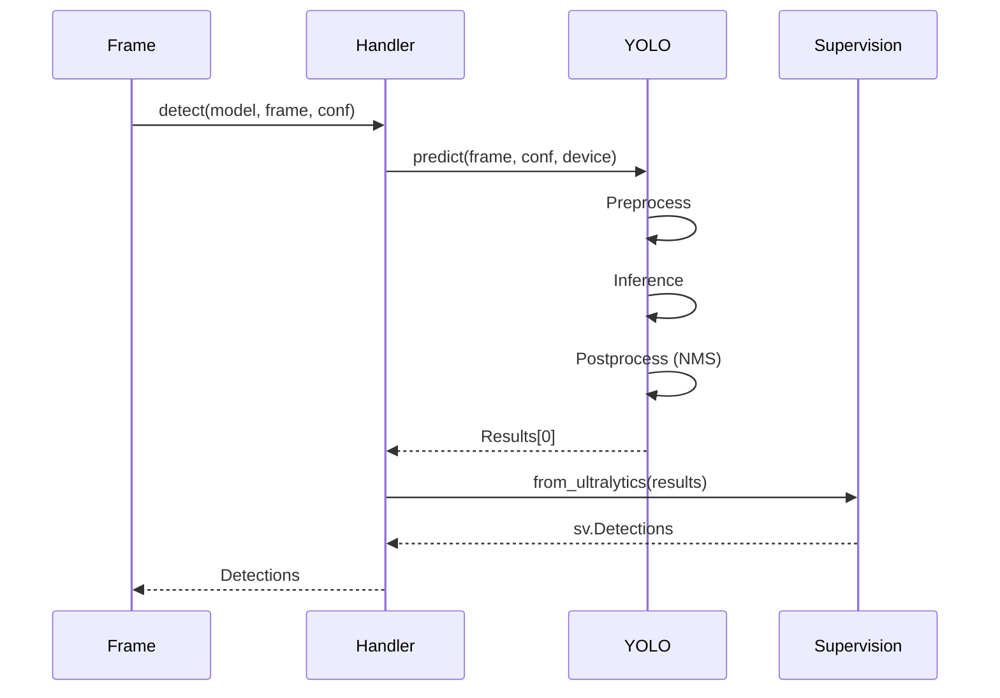
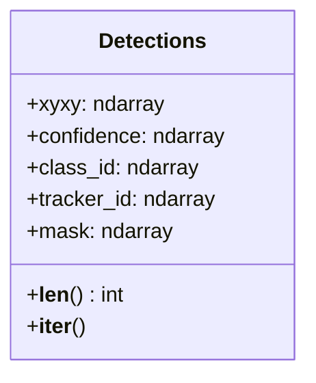
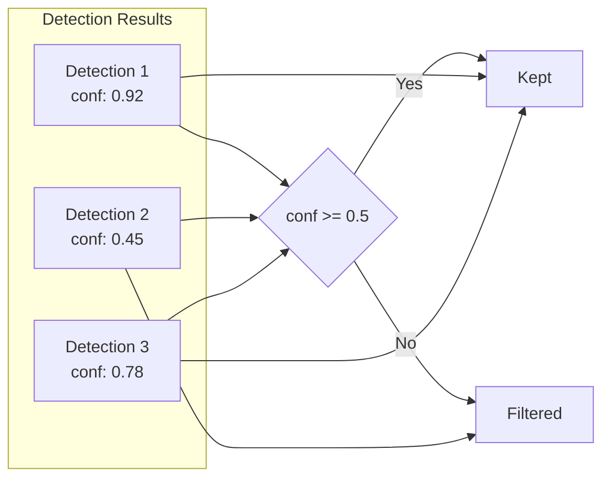
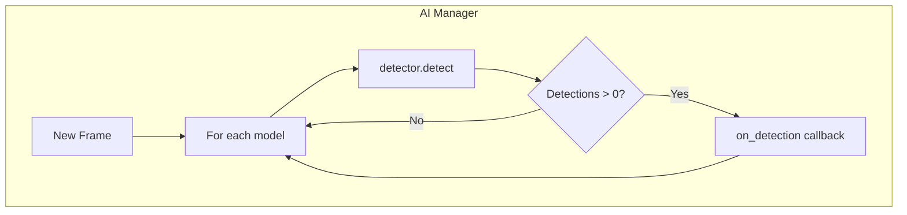

# Model Detection Handler

The Model Detection Handler executes object detection inference using YOLO models and returns structured detection results using the Supervision library.

## Overview

```mermaid
classDiagram
    class ModelDetectionHandler {
        -logger: Logger
        -device: str
        +__init__()
        +detect(model, frame, confidence) sv.Detections
    }
    
    ModelDetectionHandler --> Logger
    ModelDetectionHandler --> "sv.Detections"
```

## Purpose

The Model Detection Handler provides:

1. **Inference Execution** - Run YOLO model predictions on frames
2. **Device Optimization** - Automatic GPU/CPU selection
3. **Confidence Filtering** - Configurable detection threshold
4. **Standardized Output** - Supervision Detections format

## Architecture

```mermaid
flowchart TD
    subgraph "Detection Handler"
        INPUT[Input Frame]
        MODEL[YOLO Model]
        PREDICT[model.predict()]
        CONVERT[Convert to Detections]
        OUTPUT[sv.Detections]
    end
    
    subgraph "Configuration"
        CONF[Confidence Threshold]
        DEV[Device cuda/cpu]
    end
    
    INPUT --> PREDICT
    MODEL --> PREDICT
    CONF --> PREDICT
    DEV --> PREDICT
    PREDICT --> CONVERT
    CONVERT --> OUTPUT
```

## Detection Pipeline



## API Reference

### Constructor

```python
def __init__(self)
```

Initializes the detection handler with automatic device selection.

### Methods

#### `detect(model: YOLO, frame: MatLike, confidence: float = 0.5) -> sv.Detections`

Performs object detection on a single frame.

```python
handler = ModelDetectionHandler()
detections = handler.detect(model, frame, confidence=0.5)

print(f"Found {len(detections)} objects")
for i, box in enumerate(detections.xyxy):
    print(f"Object {i}: {box}")
```

**Parameters:**
- `model`: Loaded YOLO model instance
- `frame`: Input image/frame (numpy array / MatLike)
- `confidence`: Minimum confidence threshold (0.0 - 1.0)

**Returns:** `sv.Detections` object containing all detections

## Detections Object

The `sv.Detections` object from Supervision library contains:



### Attributes

| Attribute | Type | Description |
|-----------|------|-------------|
| `xyxy` | `ndarray` | Bounding boxes [x1, y1, x2, y2] |
| `confidence` | `ndarray` | Confidence scores (0-1) |
| `class_id` | `ndarray` | Class indices |
| `tracker_id` | `ndarray` | Tracking IDs (if tracking enabled) |
| `mask` | `ndarray` | Segmentation masks (if available) |

### Example Detection Access

```python
detections = handler.detect(model, frame, 0.5)

for i in range(len(detections)):
    x1, y1, x2, y2 = detections.xyxy[i]
    conf = detections.confidence[i]
    class_id = detections.class_id[i]
    
    print(f"Box: ({x1}, {y1}) -> ({x2}, {y2})")
    print(f"Confidence: {conf:.2f}")
    print(f"Class: {class_id}")
```

## Confidence Threshold



### Threshold Guidelines

| Threshold | Use Case |
|-----------|----------|
| 0.25 - 0.35 | High recall, more false positives |
| 0.40 - 0.50 | Balanced (recommended default) |
| 0.60 - 0.75 | High precision, may miss objects |
| 0.80+ | Very strict, only confident detections |

## Device Optimization

The handler automatically selects the best available device:

```python
self.device = "cuda" if torch.cuda.is_available() else "cpu"
```

### Performance Comparison

| Device | Typical FPS (YOLOv8n) |
|--------|----------------------|
| CPU | 5-15 FPS |
| GTX 1650 | 30-45 FPS |
| RTX 3060 | 60-90 FPS |
| RTX 3090 | 100-150 FPS |

## Verbose Mode

The handler runs predictions with `verbose=False` to suppress console output:

```python
results = model.predict(frame, conf=confidence, device=self.device, verbose=False)
```

## Usage Example

```python
from Handlers.Model_Loader_Handler import ModelLoader
from Handlers.Model_Detection_Handler import ModelDetectionHandler
import cv2

# Load model
loader = ModelLoader()
model = loader.load_model("AI Layer/Models/Car Accident.pt")

# Initialize detection handler
detector = ModelDetectionHandler()

# Read frame
frame = cv2.imread("test_image.jpg")

# Run detection
detections = detector.detect(model, frame, confidence=0.5)

# Process results
if len(detections) > 0:
    print(f"Detected {len(detections)} objects!")
    
    for i in range(len(detections)):
        bbox = detections.xyxy[i]
        conf = detections.confidence[i]
        print(f"  Object {i+1}: bbox={bbox}, confidence={conf:.2f}")
else:
    print("No objects detected")
```

## Integration with AI Manager



## Error Handling

| Scenario | Behavior |
|----------|----------|
| Invalid model | Exception raised by YOLO |
| Invalid frame | Exception raised by YOLO |
| CUDA error | Falls back or raises exception |
| Out of memory | Raises exception |

## Related Components

- [Model Loader Handler](model_loader_handler.md) - Loads models for detection
- [Detection Visuals Handler](detection_visuals_handler.md) - Visualizes detections
- [AI Manager](../managers/ai_manager.md) - Orchestrates detection pipeline
