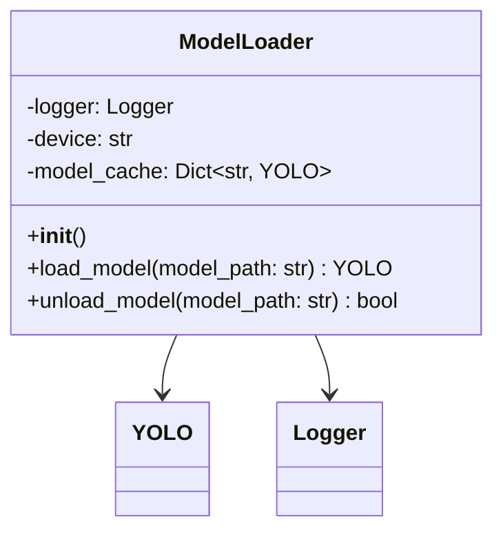
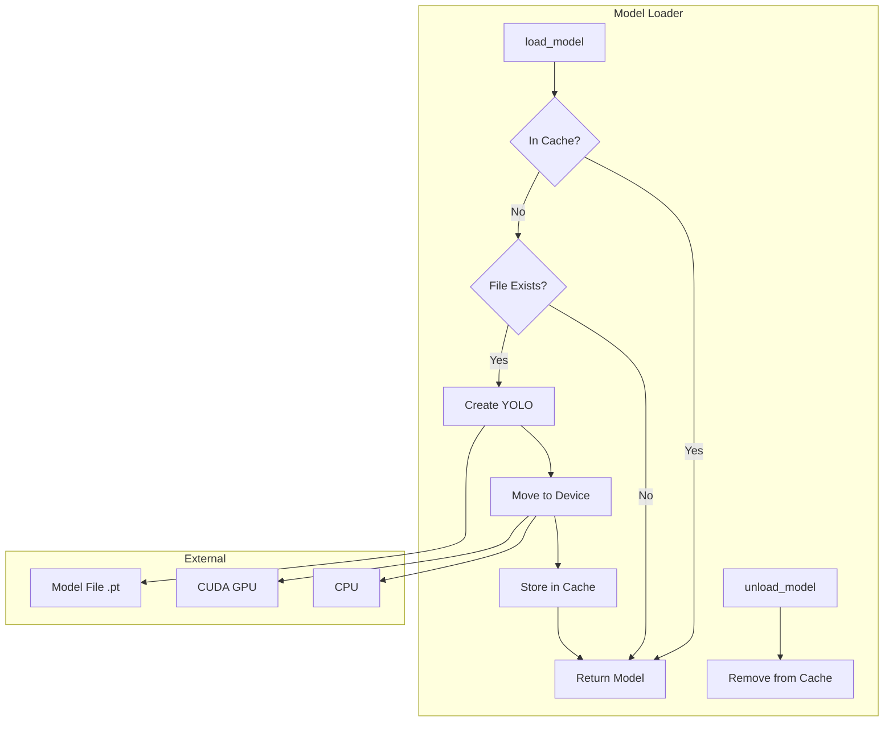
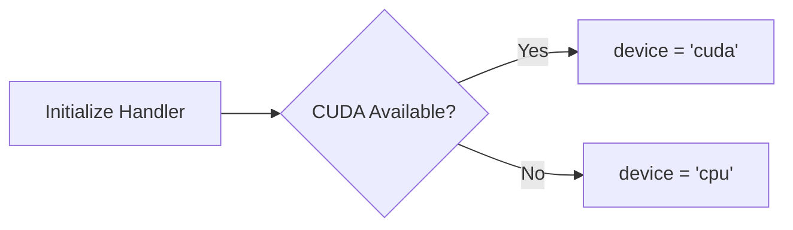
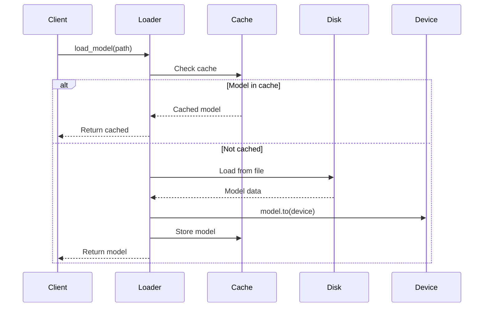
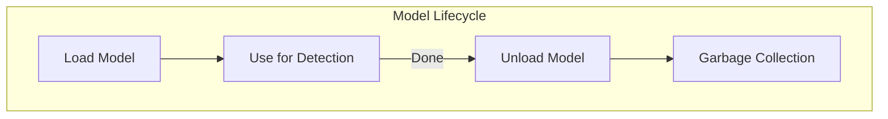
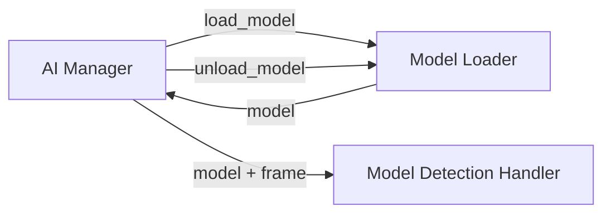

# Model Loader Handler

The Model Loader Handler is responsible for loading, caching, and managing YOLO models with automatic GPU/CPU optimization.

## Overview



## Purpose

The Model Loader Handler provides:

1. **Model Loading** - Load YOLO models from local files
2. **Caching** - Avoid reloading models that are already in memory
3. **Device Selection** - Automatic GPU/CPU selection based on availability
4. **Memory Management** - Unload models to free resources

## Architecture



## Device Selection



The handler automatically detects GPU availability using PyTorch:

```python
self.device = "cuda" if torch.cuda.is_available() else "cpu"
```

## API Reference

### Constructor

```python
def __init__(self)
```

Initializes the model loader with automatic device detection and empty cache.

### Methods

#### `load_model(model_path: str) -> Optional[YOLO]`

Loads a YOLO model from a file path.

```python
loader = ModelLoader()
model = loader.load_model("/path/to/model.pt")
if model:
    print("Model loaded successfully")
```

**Parameters:**
- `model_path`: Absolute path to the `.pt` model file

**Returns:**
- Loaded `YOLO` model object
- `None` if loading fails

**Behavior:**
1. Checks if model is already cached
2. Validates file exists
3. Loads model using Ultralytics YOLO
4. Moves model to detected device (GPU/CPU)
5. Stores in cache for future use

---

#### `unload_model(model_path: str) -> bool`

Removes a model from cache to free memory.

```python
success = loader.unload_model("/path/to/model.pt")
```

**Parameters:**
- `model_path`: Path used when loading the model

**Returns:** `True` if model was found and removed

## Caching Strategy



### Cache Structure

```python
model_cache = {
    "/path/to/accident.pt": YOLO(...),
    "/path/to/vehicle.pt": YOLO(...),
}
```

## Error Handling

| Scenario | Behavior |
|----------|----------|
| File not found | Log error, return `None` |
| Invalid model format | Log error, return `None` |
| CUDA out of memory | Falls back to CPU (automatic) |
| Corrupted model | Log error, return `None` |

## Memory Management



### Best Practices

1. **Load on startup**: Load required models during initialization
2. **Unload unused models**: Free memory when models aren't needed
3. **Reuse cached models**: Don't reload the same model repeatedly

## Usage Example

```python
from Handlers.Model_Loader_Handler import ModelLoader

# Initialize
loader = ModelLoader()
print(f"Using device: {loader.device}")  # 'cuda' or 'cpu'

# Load a model
model = loader.load_model("AI Layer/Models/Car Accident.pt")

if model:
    # Use the model for inference
    results = model.predict(frame)
    
    # Later, unload to free memory
    loader.unload_model("AI Layer/Models/Car Accident.pt")
```

## Integration with AI Manager

The Model Loader is used by the [AI Manager](../managers/ai_manager.md) to manage model lifecycle:



## Performance Considerations

### GPU Memory

| Model Size | Approximate GPU Memory |
|------------|----------------------|
| YOLOv8n | ~500 MB |
| YOLOv8s | ~1 GB |
| YOLOv8m | ~2 GB |
| YOLOv8l | ~4 GB |
| YOLOv8x | ~8 GB |

### Loading Time

- **First load**: 2-5 seconds (disk + GPU transfer)
- **Cached load**: < 1 ms (returns cached reference)

## Related Components

- [Model Detection Handler](model_detection_handler.md) - Uses loaded models
- [AI Manager](../managers/ai_manager.md) - Orchestrates model lifecycle
- [Detection Visuals Handler](detection_visuals_handler.md) - Visualizes results
