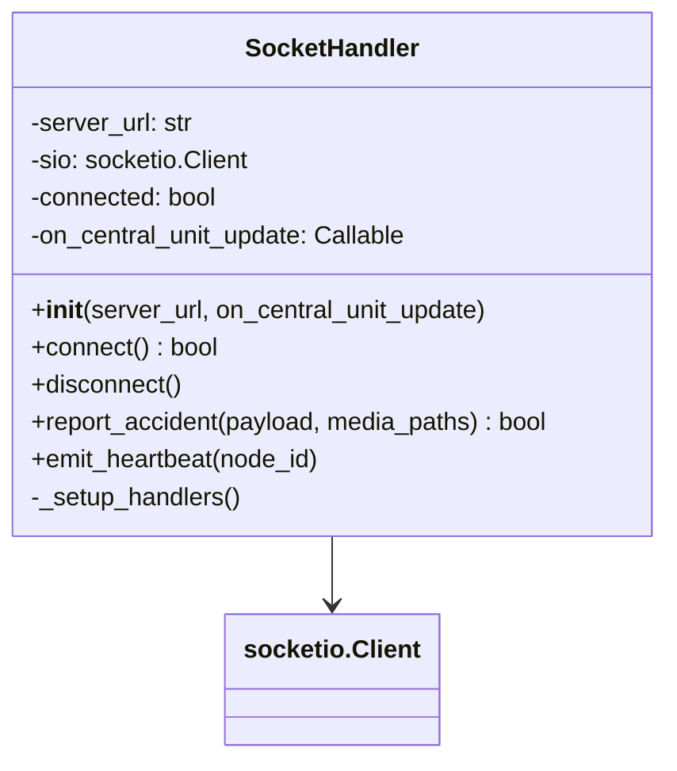
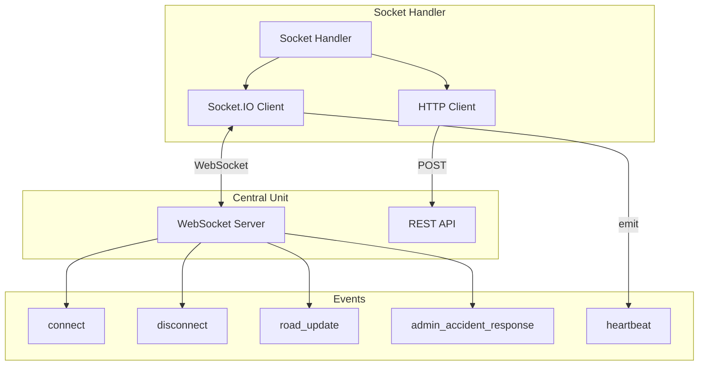
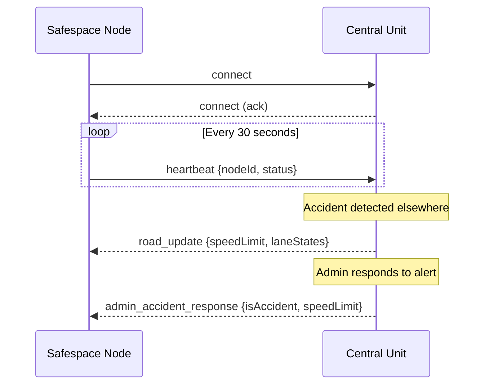
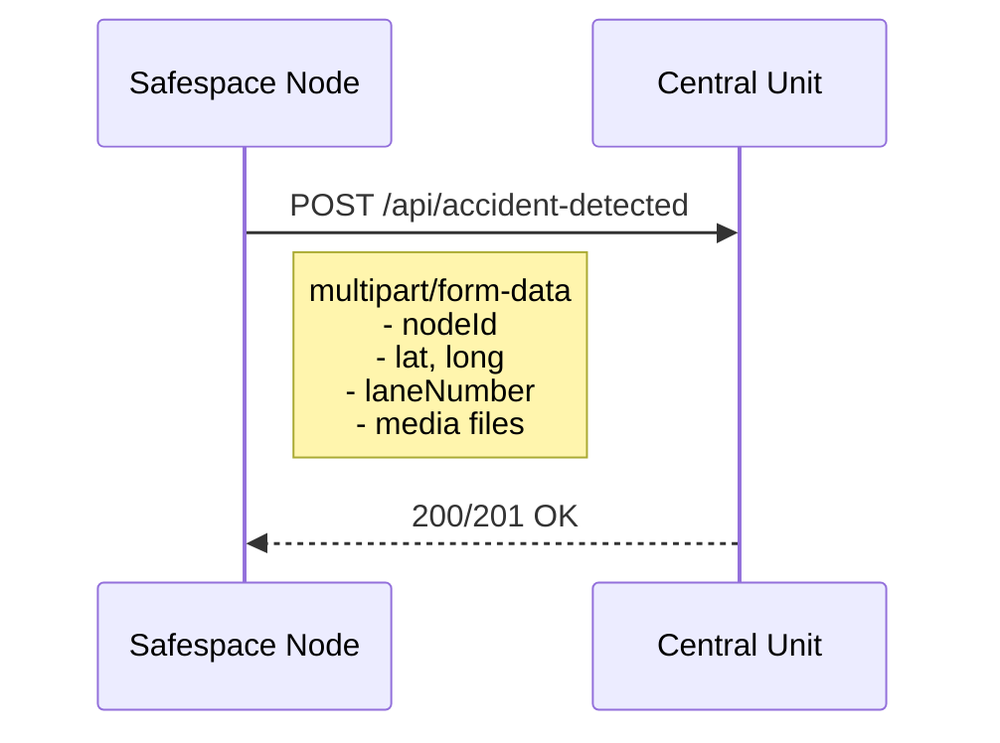

# Socket Handler

The Socket Handler manages low-level network communication with the Central Unit server using Socket.IO for real-time WebSocket communication and HTTP POST for file uploads.

## Overview



## Purpose

The Socket Handler provides:

1. **WebSocket Connection** - Real-time bidirectional communication
2. **Event Handling** - Receive instructions from Central Unit
3. **Accident Reporting** - HTTP POST with multipart file upload
4. **Heartbeat Emission** - Keep-alive signals to server

## Architecture



## Communication Protocol

### WebSocket Events



### HTTP Accident Report



## API Reference

### Constructor

```python
def __init__(self, server_url: str, on_central_unit_update: Optional[Callable] = None)
```

**Parameters:**
- `server_url`: URL of the Central Unit server (e.g., `http://192.168.1.100:5000`)
- `on_central_unit_update`: Callback function for server events

### Methods

#### `connect() -> bool`

Establishes WebSocket connection to the server.

```python
socket = SocketHandler("http://localhost:5000", callback)
if socket.connect():
    print("Connected!")
```

**Returns:** `True` if connection successful

---

#### `disconnect()`

Closes the WebSocket connection.

```python
socket.disconnect()
```

---

#### `report_accident(payload: Dict, media_paths: Optional[list]) -> bool`

Sends accident report via HTTP POST with optional media files.

```python
payload = {
    'nodeId': '1',
    'lat': '30.0444',
    'long': '31.2357',
    'laneNumber': '2'
}
media = ['/path/to/snapshot.jpg']

success = socket.report_accident(payload, media)
```

**Parameters:**
- `payload`: Dictionary with accident details
- `media_paths`: List of file paths (max 5 files)

**Returns:** `True` if report was accepted (HTTP 200/201)

---

#### `emit_heartbeat(node_id: str)`

Sends a heartbeat signal to the server.

```python
socket.emit_heartbeat("node-001")
```

## Event Handling

### Received Events

| Event | Description | Handler Action |
|-------|-------------|----------------|
| `connect` | Connection established | Log transport type |
| `disconnect` | Connection lost | Update status flag |
| `road_update` | Road state change | Forward to callback |
| `central_unit_update` | Instruction from admin | Forward to callback |
| `admin_accident_response` | Admin decision | Forward to callback |

### Event Data Structures

#### road_update / central_unit_update
```json
{
  "speedLimit": 80,
  "laneStates": ["up", "blocked", "left"],
  "isAccident": true
}
```

#### heartbeat (outgoing)
```json
{
  "nodeId": "node-001",
  "status": "active"
}
```

## Accident Report Payload

```mermaid
graph LR
    subgraph "Form Data"
        NID[nodeId: string]
        LAT[lat: string]
        LONG[long: string]
        LANE[laneNumber: string]
    end
    
    subgraph "Files"
        M1[media[0]: image/jpeg]
        M2[media[1]: image/jpeg]
        M3[...]
    end
```

### Payload Fields

| Field | Type | Description |
|-------|------|-------------|
| `nodeId` | string | Unique identifier of the node |
| `lat` | string | Latitude coordinate |
| `long` | string | Longitude coordinate |
| `laneNumber` | string | Lane where incident occurred |

### Media Upload

- Maximum **5 files** per report
- MIME type auto-detected
- Files are properly closed after upload

## Error Handling

```mermaid
flowchart TD
    CONNECT[connect()]
    SUCCESS{Success?}
    RETRY[Return False]
    OK[Return True]
    
    REPORT[report_accident()]
    UPLOAD{Upload OK?}
    LOG_ERR[Log Error]
    LOG_OK[Log Success]
    CLEANUP[Close Files]
    
    CONNECT --> SUCCESS
    SUCCESS --> |Yes| OK
    SUCCESS --> |No| RETRY
    
    REPORT --> UPLOAD
    UPLOAD --> |Yes| LOG_OK
    UPLOAD --> |No| LOG_ERR
    LOG_OK --> CLEANUP
    LOG_ERR --> CLEANUP
```

### Error Scenarios

| Scenario | Behavior |
|----------|----------|
| Connection refused | Returns `False`, logs error |
| Connection timeout | Returns `False`, logs error |
| Upload failed | Returns `False`, closes files |
| File not found | Skips file, continues with others |

## Usage Example

```python
from Handlers.Socket_Handler import SocketHandler

def handle_server_update(data):
    print(f"Server says: {data}")
    if data.get('isAccident'):
        print("Accident confirmed by server!")

# Initialize
socket = SocketHandler(
    server_url="http://192.168.1.100:5000",
    on_central_unit_update=handle_server_update
)

# Connect
if socket.connect():
    print("Connected to Central Unit")
    
    # Send heartbeat
    socket.emit_heartbeat("node-001")
    
    # Report an accident
    socket.report_accident(
        payload={
            'nodeId': 'node-001',
            'lat': '30.0444',
            'long': '31.2357',
            'laneNumber': '1'
        },
        media_paths=['/tmp/accident_snapshot.jpg']
    )

# Cleanup
socket.disconnect()
```

## Constants Used

From `utils/constants.py`:

```python
EVENT_ROAD_UPDATE = "road_update"
EVENT_CENTRAL_UNIT_UPDATE = "central_unit_update"
EVENT_HEARTBEAT = "heartbeat"
EVENT_ACCIDENT_REPORT = "/api/accident-detected"
```

## Related Components

- [Network Manager](../managers/network_manager.md) - Parent orchestrator
- [Constants](../utilities/constants.md) - Event names and endpoints
- [Failures](../utilities/failures.md) - Error tracking
