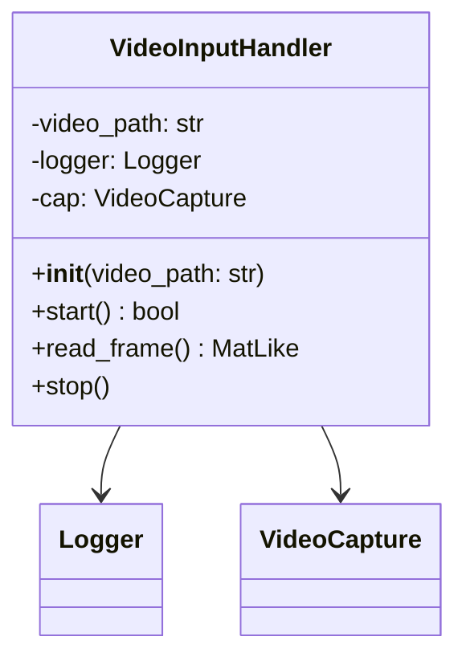
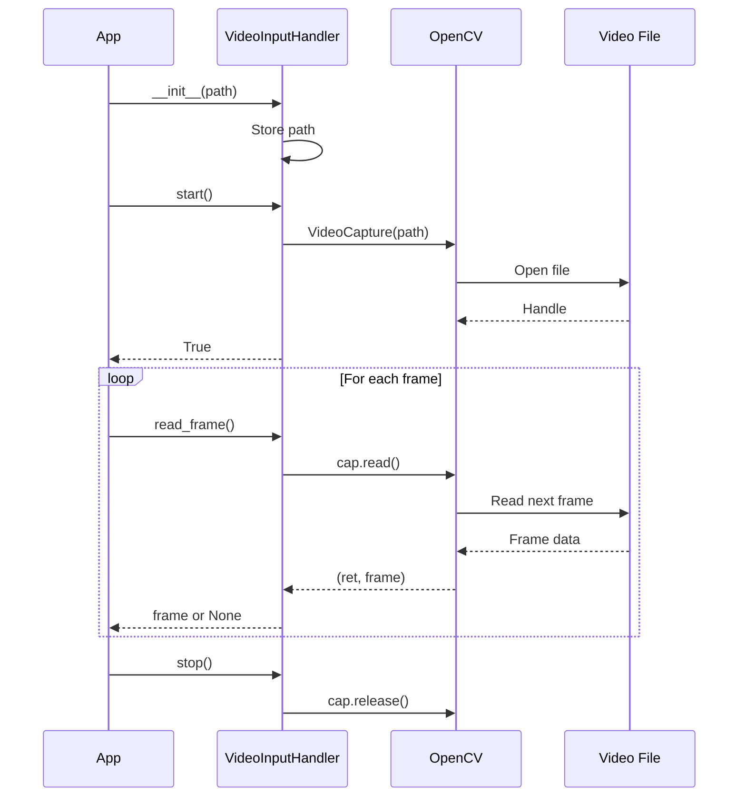
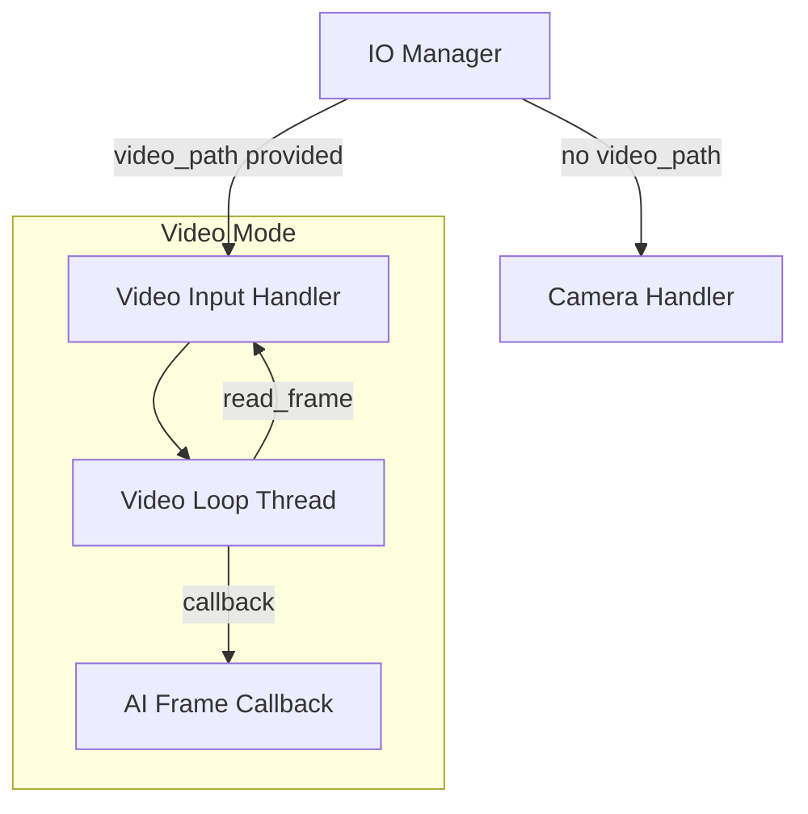

# Video Input Handler

The Video Input Handler provides video file playback capabilities for testing the AI detection system when a physical camera is not available.

## Overview



## Purpose

The Video Input Handler is a lightweight alternative to the Camera Handler, designed specifically for:

1. **Development Testing** - Test AI models without camera hardware
2. **Reproducible Testing** - Use known video files for consistent results
3. **Demo Purposes** - Showcase system capabilities with pre-recorded footage
4. **Debugging** - Analyze specific scenarios captured on video

## Architecture

```mermaid
flowchart TD
    subgraph "Video Input Handler"
        INIT[Initialize with video path]
        START[start()]
        OPEN[Open Video File]
        READ[read_frame()]
        STOP[stop()]
    end
    
    subgraph "External"
        FILE[Video File<br/>.mp4, .avi, etc.]
        IOMGR[IO Manager]
    end
    
    INIT --> START
    START --> OPEN
    OPEN --> |Success| FILE
    FILE --> READ
    READ --> |Frame| IOMGR
    READ --> |EOF| STOP
    STOP --> |Release| FILE
```

## API Reference

### Constructor

```python
def __init__(self, video_path: str)
```

Initializes the video input handler.

**Parameters:**
- `video_path`: Absolute path to the video file

### Methods

#### `start() -> bool`

Opens the video file for reading.

```python
handler = VideoInputHandler("/path/to/video.mp4")
if handler.start():
    print("Video opened successfully")
```

**Returns:** `True` if the video file was opened successfully

---

#### `read_frame() -> Optional[MatLike]`

Reads and returns the next frame from the video.

```python
frame = handler.read_frame()
if frame is not None:
    # Process the frame
    process(frame)
else:
    print("End of video or error")
```

**Returns:** 
- The next video frame as a numpy array
- `None` if end of file is reached or an error occurs

---

#### `stop()`

Releases video capture resources.

```python
handler.stop()
```

## Usage Flow



## Comparison with Camera Handler

| Feature | Camera Handler | Video Input Handler |
|---------|---------------|---------------------|
| Input Source | Physical camera | Video file |
| Threading | Internal thread | External (IO Manager) |
| Frame Callback | Built-in | Not supported |
| Looping | N/A | Handled by IO Manager |
| Frame Rate Control | Internal | External |
| Latest Frame Storage | Yes | No |

## Integration with IO Manager

The IO Manager automatically selects the Video Input Handler when a video path is provided:



When using video mode, the IO Manager:

1. Creates a dedicated thread for video playback
2. Reads frames at the configured FPS
3. Optionally loops the video when it ends
4. Forwards frames to the AI Manager via callbacks

## Usage Example

### Direct Usage

```python
from Handlers.Video_Input_Handler import VideoInputHandler

# Initialize
handler = VideoInputHandler("/path/to/test_video.mp4")

# Start
if handler.start():
    while True:
        frame = handler.read_frame()
        if frame is None:
            break
        
        # Process frame
        process_frame(frame)
    
    handler.stop()
```

### Via Command Line

```bash
# Run the node with video input
python main.py --video /path/to/test_video.mp4

# Combined with offline mode
python main.py --video /path/to/test_video.mp4 --offline
```

## Supported Formats

The handler supports all video formats that OpenCV can read:

- **MP4** (`.mp4`) - Recommended
- **AVI** (`.avi`)
- **MOV** (`.mov`)
- **MKV** (`.mkv`)
- **WebM** (`.webm`)

## Error Handling

| Scenario | Behavior |
|----------|----------|
| File not found | `start()` returns `False`, error logged |
| Corrupted file | `start()` returns `False` or `read_frame()` returns `None` |
| End of video | `read_frame()` returns `None` |
| Unsupported format | `start()` returns `False` |

## Related Components

- [Camera Handler](camera_handler.md) - Production camera input
- [IO Manager](../managers/io_manager.md) - Parent orchestrator
- [AI Manager](../managers/ai_manager.md) - Frame consumer
