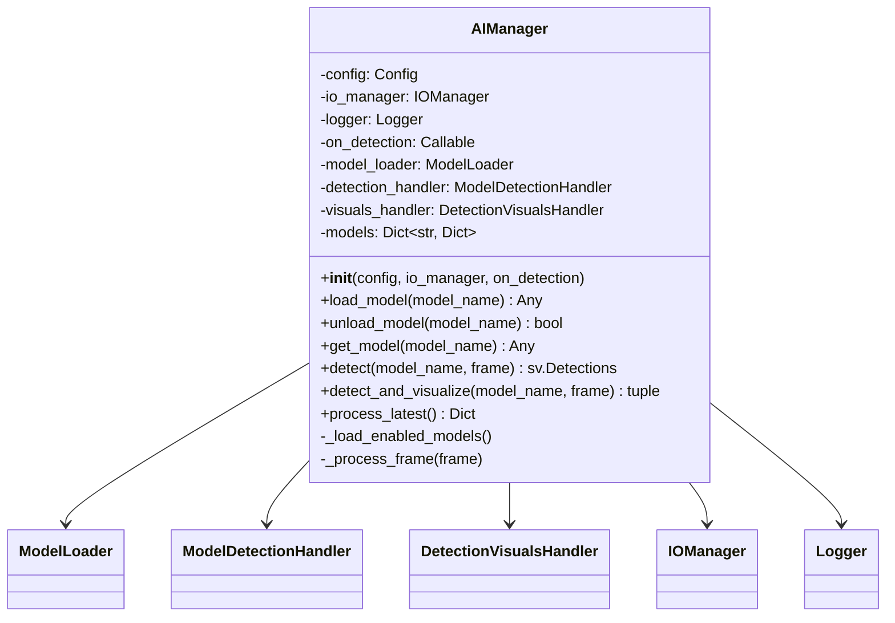
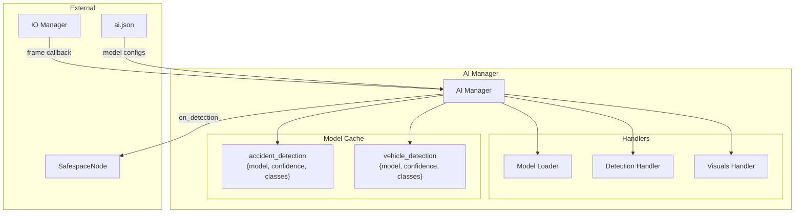
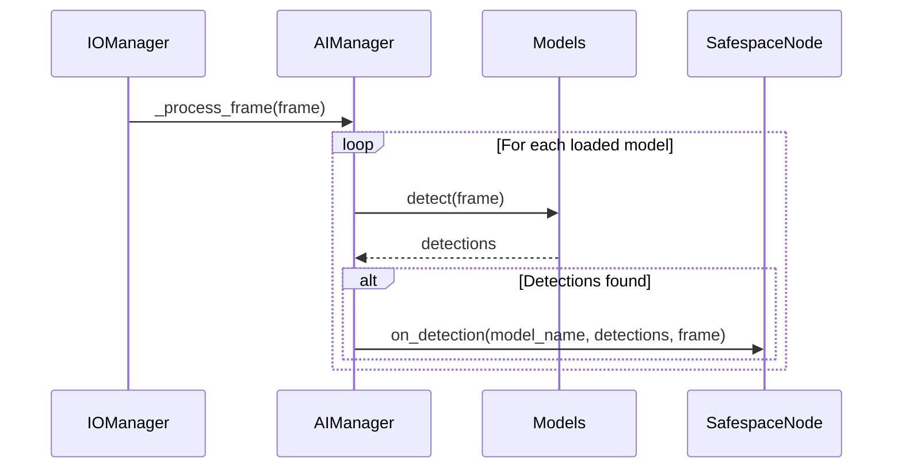
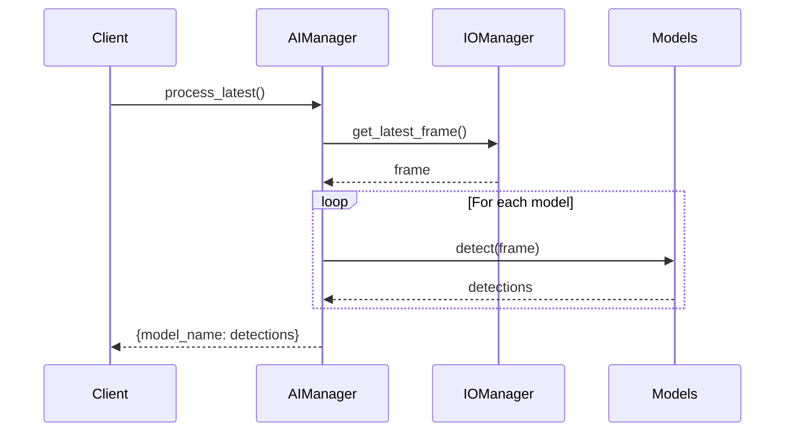
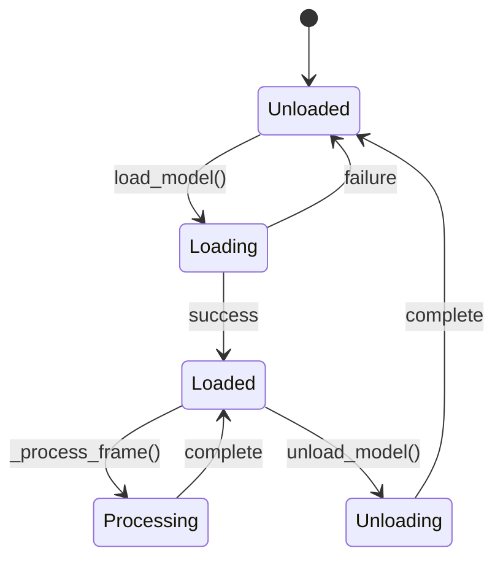
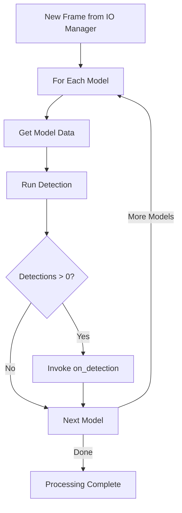
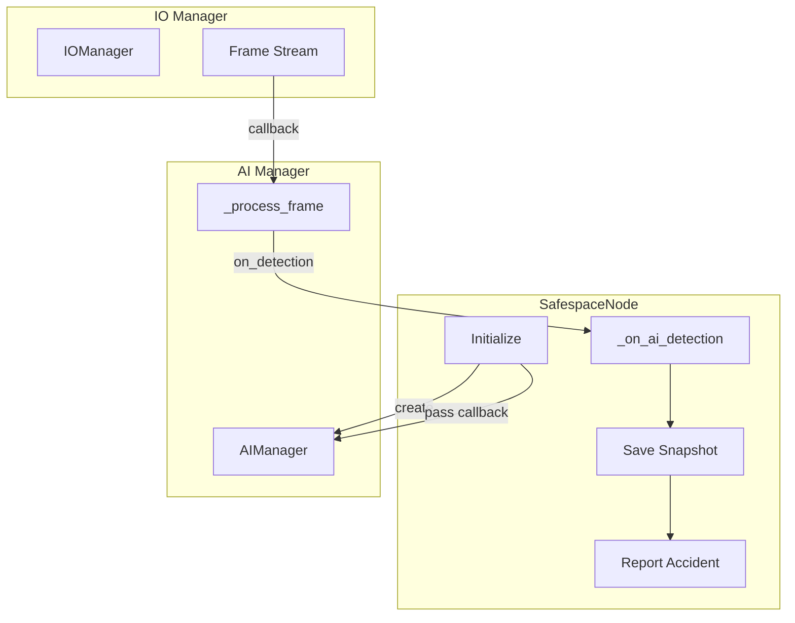

# AI Manager

The AI Manager orchestrates the AI detection pipeline, managing model loading, frame processing, and detection callbacks.

## Overview



## Purpose

The AI Manager provides:

1. **Model Lifecycle** - Load, cache, and unload detection models
2. **Automatic Processing** - Push-based frame processing via callbacks
3. **Manual Processing** - Pull-based detection on demand
4. **Detection Events** - Notify when objects are detected
5. **Visualization** - Annotate frames with detection results

## Architecture



## Detection Modes

### Push Mode (Automatic)



### Pull Mode (On Demand)



## Configuration

### ai.json Structure

```json
{
  "ai": {
    "models": {
      "accident_detection": {
        "enabled": true,
        "path": "AI Layer/Models/Car Accident.pt",
        "confidence": 0.5,
        "classes": ["accident"]
      },
      "vehicle_detection": {
        "enabled": false,
        "path": "AI Layer/Models/Vehicle.pt",
        "confidence": 0.6,
        "classes": ["car", "truck", "bus"]
      }
    }
  }
}
```

### Configuration Fields

| Field | Type | Description |
|-------|------|-------------|
| `enabled` | bool | Whether to load model on startup |
| `path` | string | Path to `.pt` model file |
| `confidence` | float | Detection threshold (0.0 - 1.0) |
| `classes` | array | Class names for labeling |

## API Reference

### Constructor

```python
def __init__(self, config: Config, io_manager: IOManager, 
             on_detection: Optional[Callable[[str, sv.Detections, MatLike], None]] = None)
```

**Parameters:**
- `config`: Configuration object
- `io_manager`: IO Manager for frame access
- `on_detection`: Callback for detections `(model_name, detections, frame)`

### Methods

#### `load_model(model_name: str) -> Optional[Any]`

Loads a model by name from configuration.

```python
model = ai_manager.load_model("accident_detection")
```

**Returns:** Loaded model or `None` if failed

---

#### `unload_model(model_name: str) -> bool`

Unloads a model from cache.

```python
ai_manager.unload_model("accident_detection")
```

**Returns:** `True` if model was unloaded

---

#### `get_model(model_name: str) -> Optional[Any]`

Retrieves a loaded model by name.

```python
model = ai_manager.get_model("accident_detection")
```

---

#### `detect(model_name: str, frame: MatLike) -> Optional[sv.Detections]`

Runs detection on a frame with a specific model.

```python
detections = ai_manager.detect("accident_detection", frame)
if detections and len(detections) > 0:
    print(f"Found {len(detections)} objects")
```

---

#### `detect_and_visualize(model_name: str, frame: MatLike) -> tuple`

Runs detection and returns annotated frame.

```python
detections, annotated_frame = ai_manager.detect_and_visualize("accident_detection", frame)
cv2.imshow("Detections", annotated_frame)
```

**Returns:** `(detections, annotated_frame)`

---

#### `process_latest() -> Dict[str, sv.Detections]`

Processes the latest frame with all loaded models.

```python
results = ai_manager.process_latest()
for model_name, detections in results.items():
    print(f"{model_name}: {len(detections)} detections")
```

**Returns:** Dictionary mapping model names to detections

## Model Lifecycle



## Model Cache Structure

```python
self.models = {
    "accident_detection": {
        "model": YOLO(...),      # Loaded model
        "confidence": 0.5,        # Detection threshold
        "classes": ["accident"]   # Class names
    },
    "vehicle_detection": {
        "model": YOLO(...),
        "confidence": 0.6,
        "classes": ["car", "truck", "bus"]
    }
}
```

## Frame Processing Flow



## Error Handling

| Scenario | Behavior |
|----------|----------|
| Model not found | Log error, return `None` |
| Invalid config | Log error, skip model |
| Detection error | Exception propagated |
| Frame callback error | Logged in IO Manager |

## Usage Example

```python
from Managers.AI_Manger import AIManager
from Managers.IO_Manager import IOManager
from utils.config import Config

def on_detection(model_name, detections, frame):
    print(f"[{model_name}] Detected {len(detections)} objects!")
    
    if 'accident' in model_name:
        # Handle accident detection
        save_snapshot(frame)
        report_accident()

# Initialize
config = Config()
io_manager = IOManager(config)
ai_manager = AIManager(config, io_manager, on_detection=on_detection)

# Models are auto-loaded based on config
print(f"Loaded models: {list(ai_manager.models.keys())}")

# Manual detection (optional)
frame = io_manager.get_latest_frame()
if frame is not None:
    detections = ai_manager.detect("accident_detection", frame)
```

## Integration with SafespaceNode



## Performance Considerations

### Multiple Models

Running multiple models increases processing time:

| Models | Typical Frame Time |
|--------|-------------------|
| 1 model | 30-50 ms |
| 2 models | 60-100 ms |
| 3 models | 90-150 ms |

### Optimization Tips

1. **Disable unused models** in config
2. **Use smaller models** (YOLOv8n vs YOLOv8x)
3. **Adjust confidence threshold** to reduce post-processing
4. **Use GPU acceleration** when available

## Related Components

- [Model Loader Handler](../handlers/model_loader_handler.md) - Model loading
- [Model Detection Handler](../handlers/model_detection_handler.md) - Inference
- [Detection Visuals Handler](../handlers/detection_visuals_handler.md) - Visualization
- [IO Manager](io_manager.md) - Frame source
- [SafespaceNode](../core/main.md) - Detection consumer
