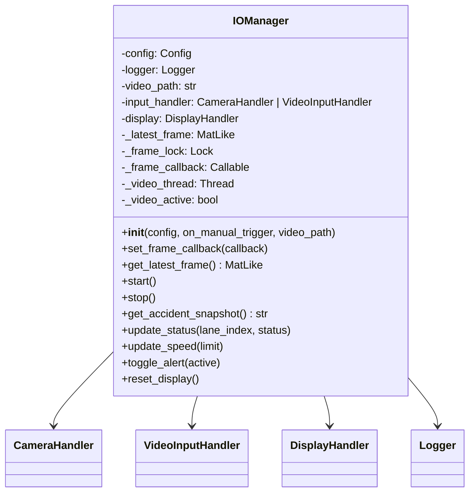
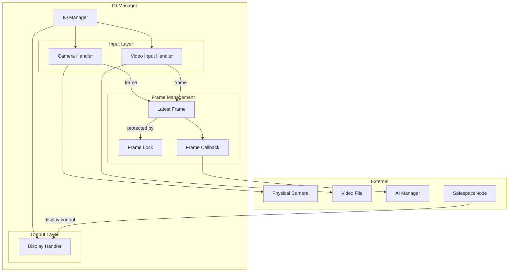
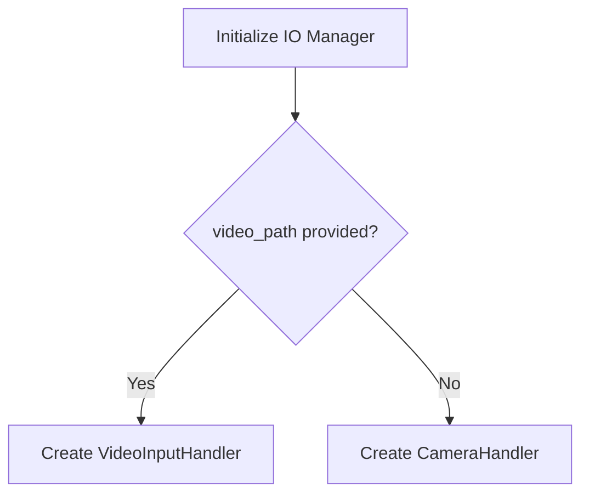
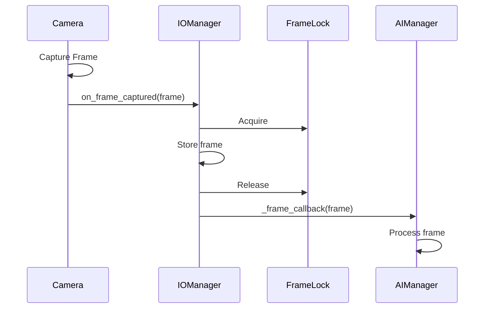
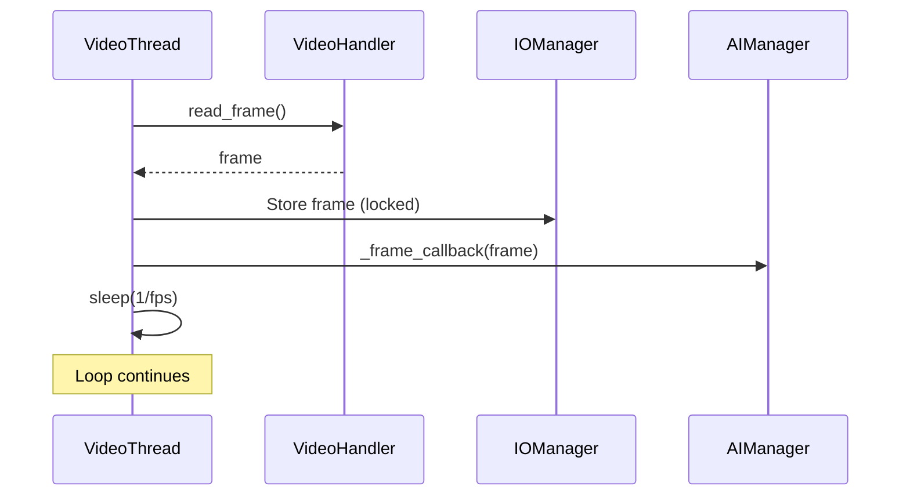
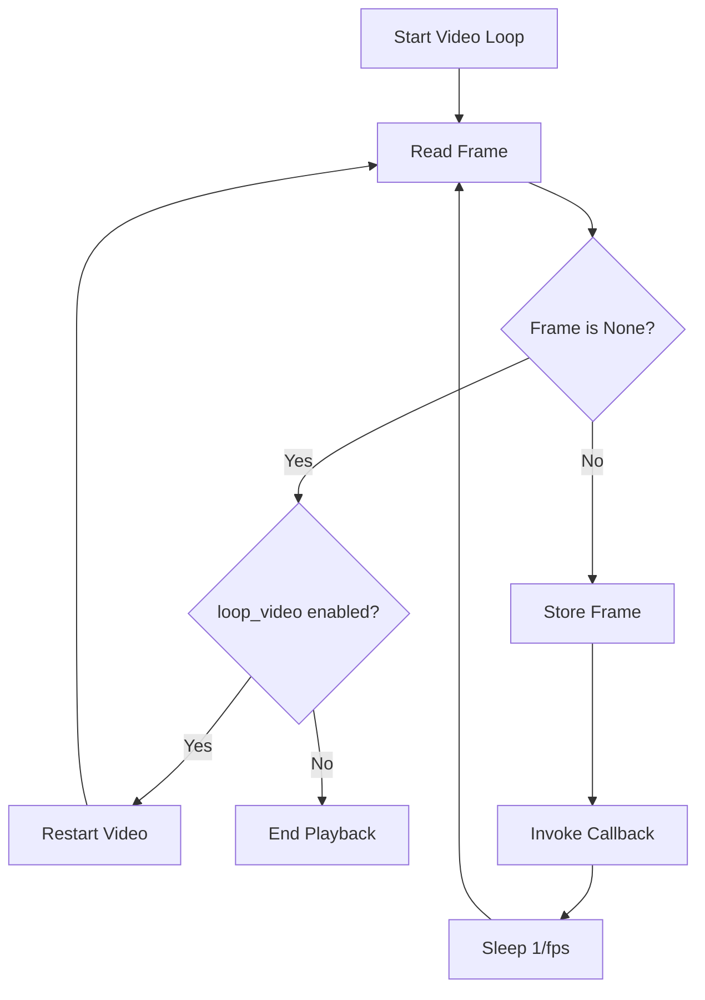
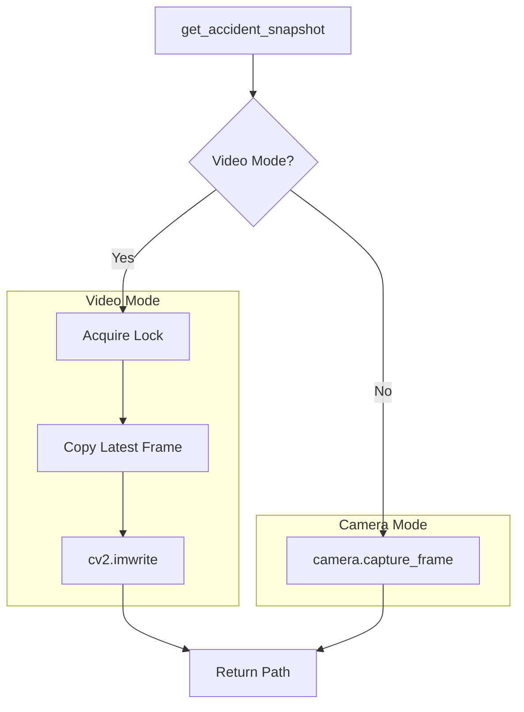
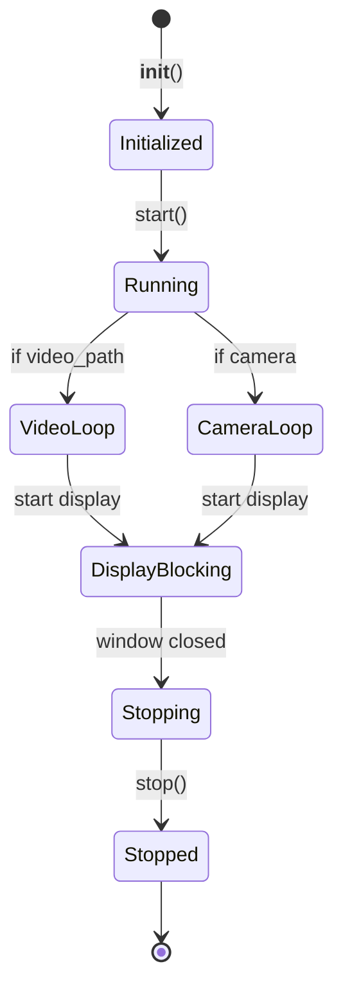
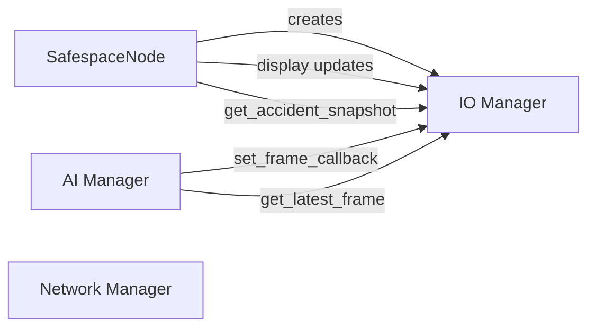

# IO Manager

The IO Manager orchestrates the coordination between input sources (Camera/Video) and output (Display), serving as the central hub for frame management and UI control.

## Overview



## Purpose

The IO Manager provides:

1. **Input Abstraction** - Unified interface for camera and video sources
2. **Frame Management** - Thread-safe frame storage and distribution
3. **Display Control** - Bridge methods for UI updates
4. **Snapshot Capture** - Save frames for accident reports
5. **Video Playback** - Background thread for video file processing

## Architecture



## Input Source Selection



## Configuration

| Key | Type | Default | Description |
|-----|------|---------|-------------|
| `camera.index` | int | 0 | Camera device index |
| `camera.fps` | int | 30 | Frame rate |
| `camera.width` | int | 640 | Frame width |
| `camera.height` | int | 480 | Frame height |
| `camera.loop_video` | bool | true | Loop video files |

## API Reference

### Constructor

```python
def __init__(self, config: Config, on_manual_trigger: Optional[Callable] = None, 
             video_path: Optional[str] = None)
```

**Parameters:**
- `config`: Configuration object
- `on_manual_trigger`: Callback for spacebar press (passed to Display)
- `video_path`: Optional video file path (activates video mode)

### Methods

#### `set_frame_callback(callback: Callable[[MatLike], None])`

Registers a callback to receive new frames (used by AI Manager).

```python
def process_frame(frame):
    detections = model.detect(frame)

io_manager.set_frame_callback(process_frame)
```

---

#### `get_latest_frame() -> Optional[MatLike]`

Thread-safe method to retrieve the most recent frame.

```python
frame = io_manager.get_latest_frame()
if frame is not None:
    cv2.imshow("Latest", frame)
```

**Returns:** Copy of the latest frame, or `None` if no frame available

---

#### `start()`

Starts the IO components. **This call blocks** (runs Qt event loop).

```python
io_manager.start()  # Blocks here until window closed
```

---

#### `stop()`

Cleanly stops all handlers and threads.

```python
io_manager.stop()
```

---

#### `get_accident_snapshot() -> Optional[str]`

Captures the current frame and saves it to disk.

```python
path = io_manager.get_accident_snapshot()
if path:
    print(f"Snapshot saved: {path}")
```

**Returns:** Absolute path to saved image, or `None` if failed

---

#### Display Bridge Methods

```python
io_manager.update_status(0, "blocked")   # Update lane status
io_manager.update_speed(80)               # Update speed limit
io_manager.toggle_alert(True)             # Show/hide alert
io_manager.reset_display()                # Reset to defaults
```

## Frame Flow

### Camera Mode



### Video Mode



## Video Loop Logic



## Thread Safety

The IO Manager uses a `threading.Lock` to protect frame access:

```python
# Writing (Camera/Video thread)
with self._frame_lock:
    self._latest_frame = frame.copy()

# Reading (AI Manager or Main thread)
with self._frame_lock:
    return self._latest_frame.copy() if self._latest_frame is not None else None
```

## Snapshot Capture



### Snapshot Location

Snapshots are saved to: `safespace/assets/accidents_images/`

Filename format: `accident_YYYYMMDD_HHMMSS.jpg`

## Lifecycle



## Usage Example

```python
from Managers.IO_Manager import IOManager
from utils.config import Config

def on_spacebar():
    print("Manual report triggered!")

def on_frame(frame):
    print(f"New frame: {frame.shape}")

# Initialize
config = Config()
io_manager = IOManager(
    config,
    on_manual_trigger=on_spacebar,
    video_path="/path/to/test.mp4"  # Optional
)

# Register frame callback for AI
io_manager.set_frame_callback(on_frame)

# Start (blocks)
io_manager.start()
```

## Integration Points



## Related Components

- [Camera Handler](../handlers/camera_handler.md) - Camera input
- [Video Input Handler](../handlers/video_input_handler.md) - Video input
- [Display Handler](../handlers/display_handler.md) - GUI output
- [AI Manager](ai_manager.md) - Frame consumer
- [SafespaceNode](../core/main.md) - Parent orchestrator
