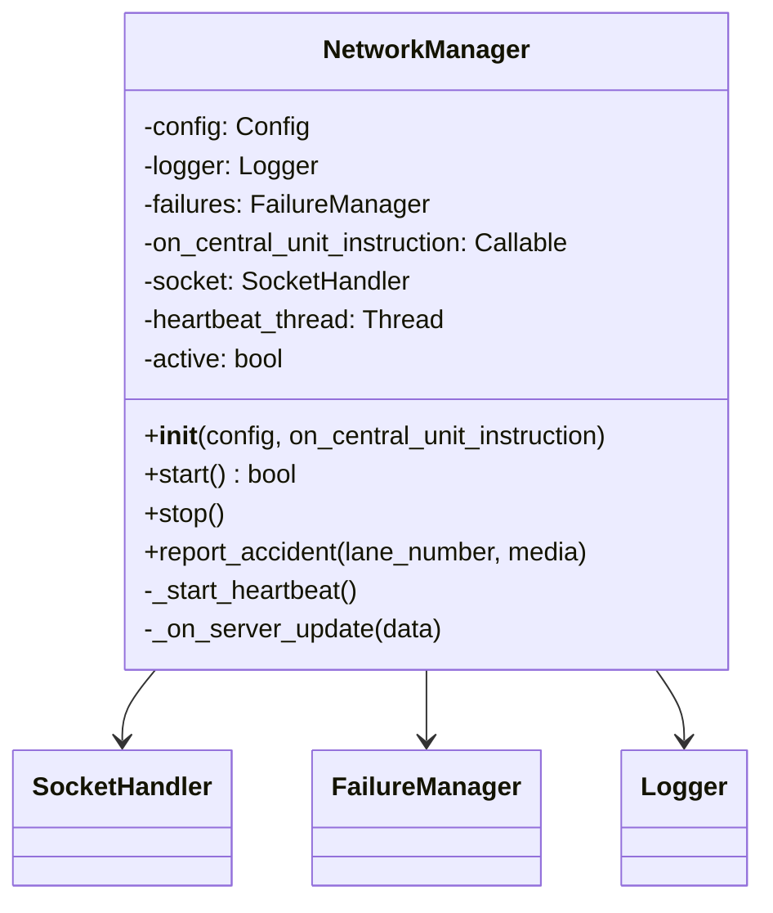
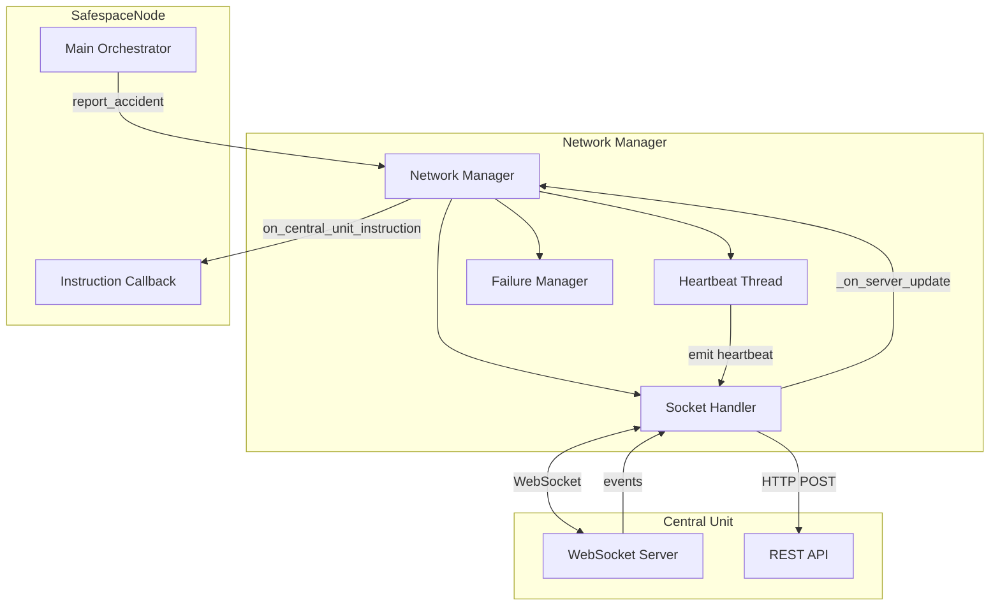
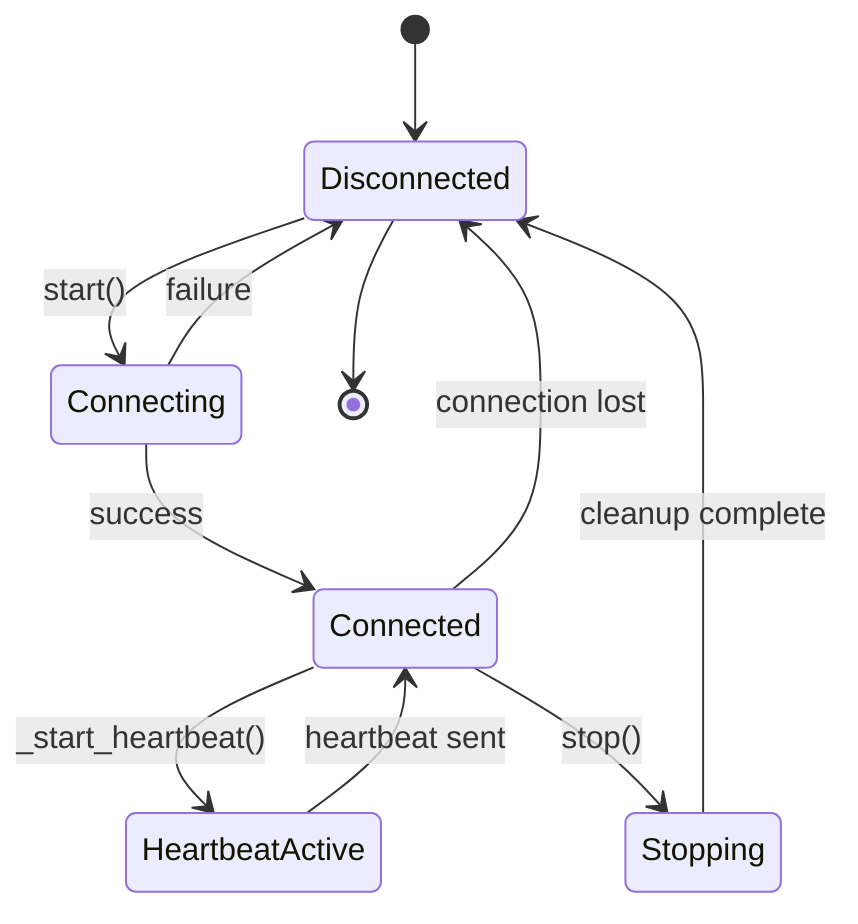
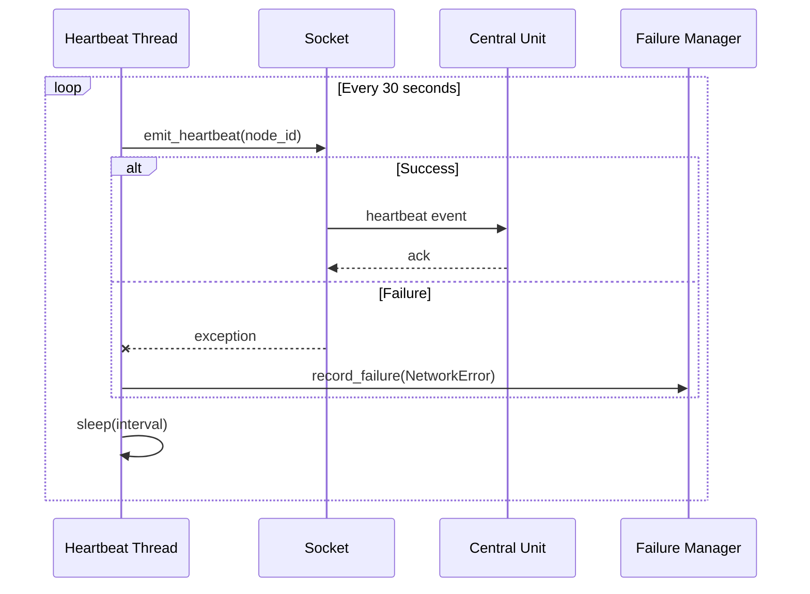
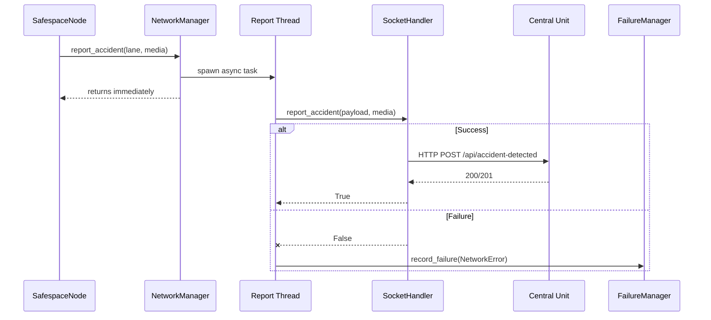
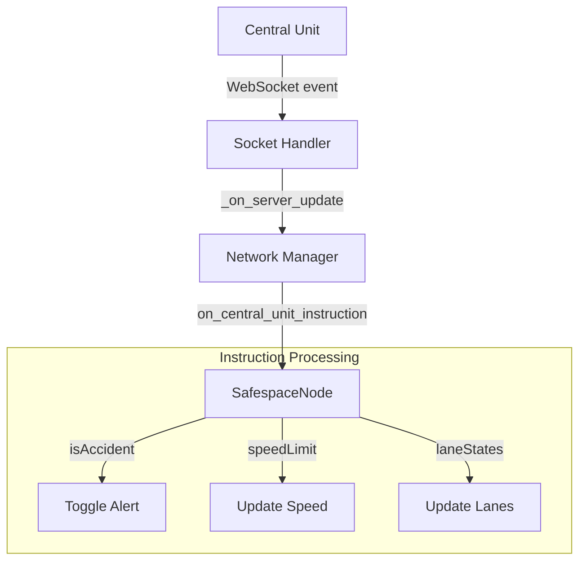
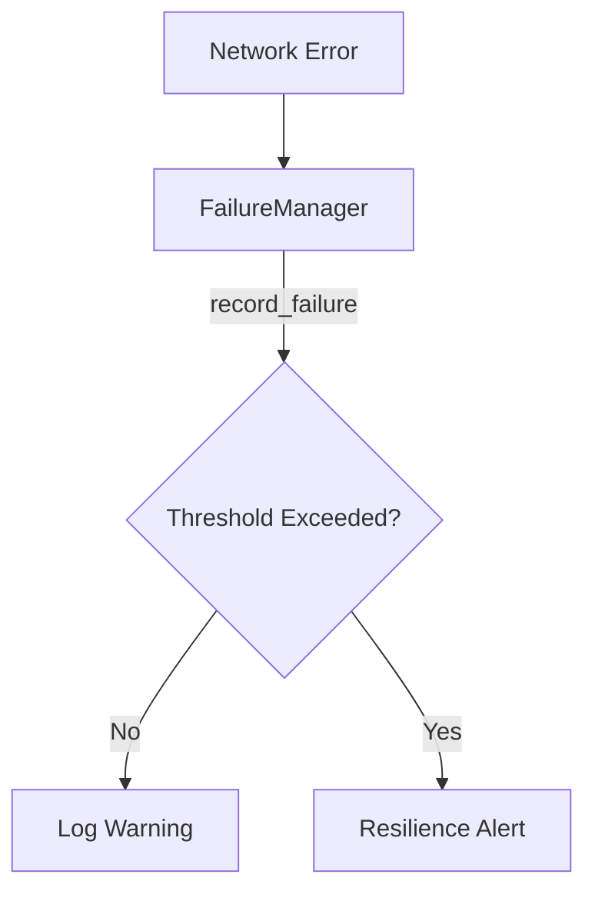

# Network Manager

The Network Manager orchestrates high-level network operations, including connection management, heartbeat monitoring, and accident reporting to the Central Unit.

## Overview



## Purpose

The Network Manager provides:

1. **Connection Management** - Establish and maintain server connection
2. **Heartbeat Service** - Keep-alive signals to Central Unit
3. **Accident Reporting** - Async upload of incident data with media
4. **Instruction Handling** - Process commands from Central Unit
5. **Failure Tracking** - Monitor and log network errors

## Architecture



## Connection Lifecycle



## Configuration

### network.json Structure

```json
{
  "network": {
    "server_url": "http://192.168.1.100:5000",
    "heartbeat_interval": 30
  }
}
```

### Configuration Fields

| Field | Type | Default | Description |
|-------|------|---------|-------------|
| `server_url` | string | - | Central Unit server URL |
| `heartbeat_interval` | int | 30 | Seconds between heartbeats |

## API Reference

### Constructor

```python
def __init__(self, config: Config, on_central_unit_instruction: Optional[Callable] = None)
```

**Parameters:**
- `config`: Configuration object
- `on_central_unit_instruction`: Callback for server instructions

### Methods

#### `start() -> bool`

Starts the network service and establishes connection.

```python
network = NetworkManager(config, callback)
if network.start():
    print("Connected to Central Unit")
else:
    print("Connection failed - running offline")
```

**Returns:** `True` if connection successful

---

#### `stop()`

Cleanly shuts down network operations.

```python
network.stop()
```

---

#### `report_accident(lane_number: str, media: Optional[list] = None)`

Asynchronously reports an accident to the server.

```python
network.report_accident(
    lane_number="1",
    media=["/path/to/snapshot.jpg"]
)
```

**Parameters:**
- `lane_number`: Lane where incident occurred
- `media`: List of media file paths (images/videos)

## Heartbeat Service



### Heartbeat Configuration

Default interval: **30 seconds**

Configurable via `network.heartbeat_interval` or `DEFAULT_HEARTBEAT_INTERVAL` constant.

## Accident Reporting Flow



### Report Payload

```python
payload = {
    'nodeId': '1',           # From config
    'lat': '30.0444',        # From config
    'long': '31.2357',       # From config
    'laneNumber': '1'        # From parameter
}
```

## Server Instructions



### Instruction Data Structure

```json
{
  "isAccident": true,
  "speedLimit": 80,
  "laneStates": ["up", "blocked", "left"]
}
```

## Failure Tracking



### Error Types

| Error | Source | Severity |
|-------|--------|----------|
| Connection failed | start() | Critical |
| Heartbeat failed | _start_heartbeat() | Warning |
| Report upload failed | report_accident() | Warning |

## Usage Example

```python
from Managers.Network_Manager import NetworkManager
from utils.config import Config

def on_instruction(data):
    print(f"Server instruction: {data}")
    
    if data.get('isAccident'):
        print("Accident confirmed!")
        update_display(data)

# Initialize
config = Config()
network = NetworkManager(config, on_central_unit_instruction=on_instruction)

# Start
if network.start():
    print("Connected")
    
    # Report an accident
    network.report_accident(
        lane_number="2",
        media=["/tmp/accident.jpg"]
    )
else:
    print("Running in offline mode")

# Later: cleanup
network.stop()
```

## Offline Mode

When running in offline mode (network unavailable or `--offline` flag):

```mermaid
flowchart TD
    START[start()]
    CHECK{Connection Success?}
    ONLINE[Online Mode]
    OFFLINE[Offline Mode]
    
    START --> CHECK
    CHECK --> |Yes| ONLINE
    CHECK --> |No| OFFLINE
    
    subgraph "Online"
        HB[Heartbeat Active]
        REPORT[Accident Reports]
        INST[Receive Instructions]
    end
    
    subgraph "Offline"
        NOHB[No Heartbeat]
        NOREPORT[Reports Queued/Lost]
        NOINST[No Instructions]
    end
    
    ONLINE --> HB
    ONLINE --> REPORT
    ONLINE --> INST
    
    OFFLINE --> NOHB
    OFFLINE --> NOREPORT
    OFFLINE --> NOINST
```

## Thread Safety

The Network Manager spawns two types of threads:

1. **Heartbeat Thread** - Daemon thread for periodic keep-alive
2. **Report Threads** - One-shot daemon threads for async uploads

All threads are daemon threads, ensuring clean shutdown.

## Related Components

- [Socket Handler](../handlers/socket_handler.md) - Low-level networking
- [Failures](../utilities/failures.md) - Error tracking
- [Config](../utilities/config.md) - Network configuration
- [SafespaceNode](../core/main.md) - Parent orchestrator
