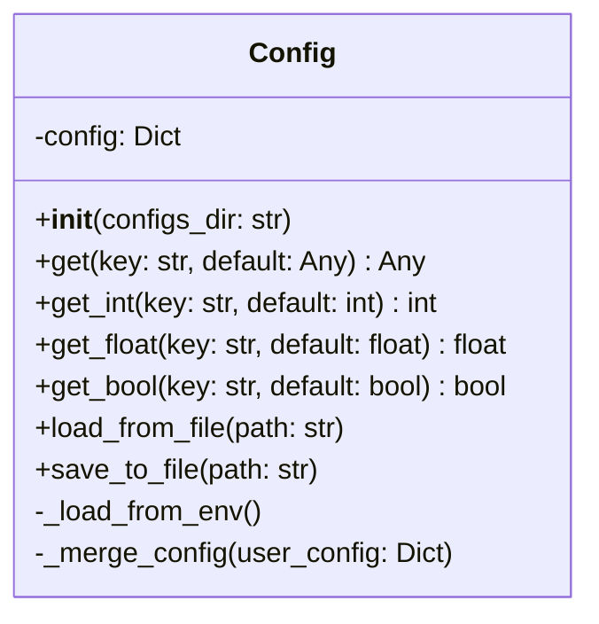
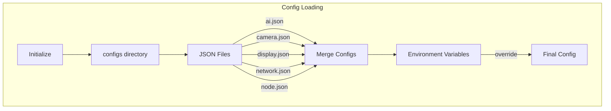
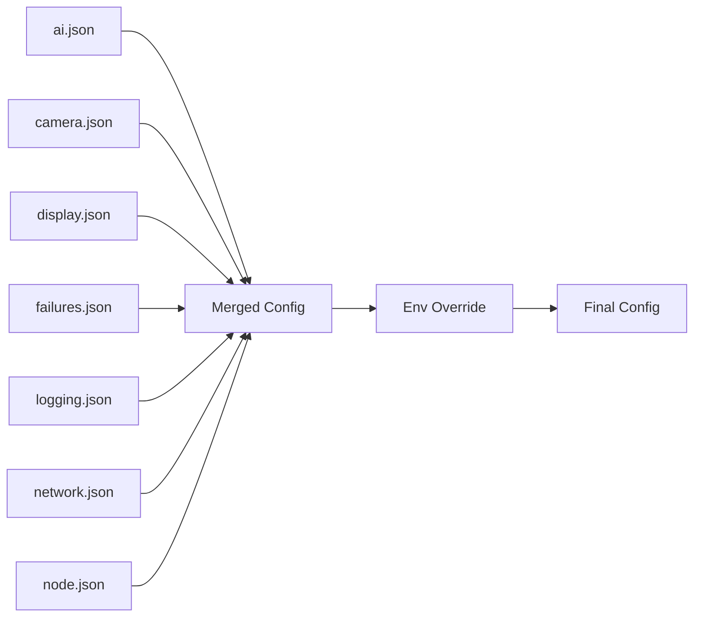
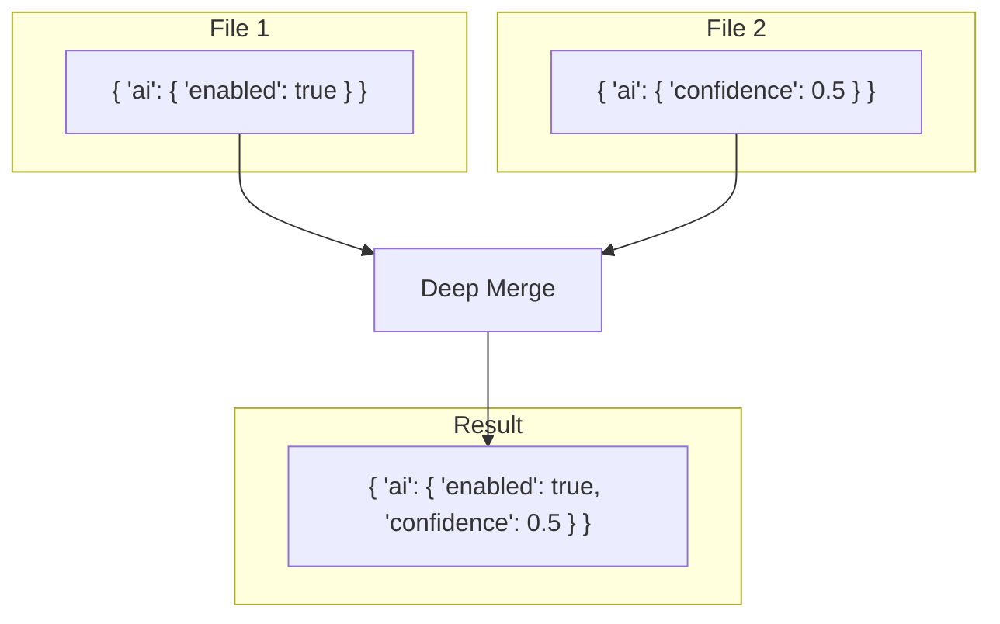
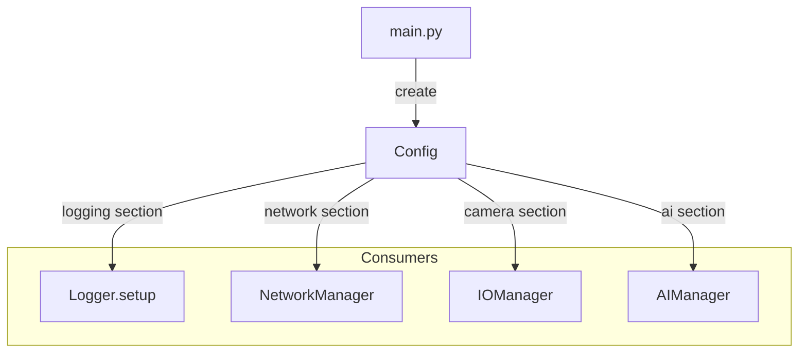

# Config Utility

The Config utility provides centralized configuration management by loading and merging multiple JSON configuration files.

## Overview



## Purpose

The Config utility provides:

1. **Multi-file Configuration** - Load and merge multiple JSON files
2. **Dot-notation Access** - Access nested values with `"section.key"` syntax
3. **Type-safe Getters** - Get values as specific types with defaults
4. **Environment Override** - Override settings via environment variables
5. **Deep Merging** - Nested configuration objects are merged recursively

## Architecture



## Configuration Files

### Directory Structure

```
safespace/configs/
├── ai.json          # AI model settings
├── camera.json      # Camera/video settings
├── display.json     # GUI settings
├── failures.json    # Error handling settings
├── logging.json     # Logger configuration
├── network.json     # Network/server settings
└── node.json        # Node identity settings
```

### Loading Order

Files are loaded in **alphabetical order** and merged:



## Configuration Examples

### ai.json
```json
{
  "ai": {
    "models": {
      "accident_detection": {
        "enabled": true,
        "path": "AI Layer/Models/Car Accident.pt",
        "confidence": 0.5
      }
    }
  }
}
```

### camera.json
```json
{
  "camera": {
    "index": 0,
    "fps": 30,
    "width": 1280,
    "height": 720,
    "loop_video": true
  }
}
```

### network.json
```json
{
  "network": {
    "server_url": "http://192.168.1.100:5000",
    "heartbeat_interval": 30
  }
}
```

### node.json
```json
{
  "node": {
    "id": "node-001",
    "lanes": 3,
    "default_speed": 120,
    "location": {
      "lat": "30.0444",
      "long": "31.2357"
    }
  }
}
```

## API Reference

### Constructor

```python
def __init__(self, configs_dir: str = None)
```

**Parameters:**
- `configs_dir`: Path to configs directory (defaults to `safespace/configs`)

### Methods

#### `get(key: str, default: Any = None) -> Any`

Gets a configuration value using dot notation.

```python
config = Config()

# Simple access
server = config.get('network.server_url')

# With default
fps = config.get('camera.fps', 30)

# Nested access
lat = config.get('node.location.lat', '0.0')
```

---

#### `get_int(key: str, default: int = 0) -> int`

Gets a value as an integer.

```python
fps = config.get_int('camera.fps', 30)
lanes = config.get_int('node.lanes', 3)
```

---

#### `get_float(key: str, default: float = 0.0) -> float`

Gets a value as a float.

```python
confidence = config.get_float('ai.models.accident.confidence', 0.5)
```

---

#### `get_bool(key: str, default: bool = False) -> bool`

Gets a value as a boolean.

```python
enabled = config.get_bool('ai.models.accident.enabled', True)
loop = config.get_bool('camera.loop_video', True)
```

Truthy values: `True`, `"true"`, `"1"`, `"yes"`, `"on"`

---

#### `load_from_file(path: str)`

Loads and merges configuration from a specific file.

```python
config.load_from_file('/path/to/custom.json')
```

---

#### `save_to_file(path: str)`

Saves current configuration to a file.

```python
config.save_to_file('/path/to/backup.json')
```

## Dot Notation Access

```mermaid
flowchart LR
    KEY["'node.location.lat'"]
    SPLIT[Split by '.']
    TRAVERSE[Traverse Dict]
    VALUE["'30.0444'"]
    
    KEY --> SPLIT
    SPLIT --> |['node', 'location', 'lat']| TRAVERSE
    TRAVERSE --> VALUE
```

### Example

```python
# Config structure
config = {
    "node": {
        "location": {
            "lat": "30.0444",
            "long": "31.2357"
        }
    }
}

# Access nested value
lat = config.get('node.location.lat')  # "30.0444"
```

## Deep Merge Behavior



### Merge Rules

1. **Dicts are merged recursively**
2. **Other values are overwritten**
3. **Later files override earlier ones**

## Environment Variable Override

The following environment variables override config values:

| Environment Variable | Config Key |
|---------------------|------------|
| `NODE_ID` | `node.id` |
| `SERVER_URL` | `network.server_url` |

```bash
# Override node ID
export NODE_ID="node-production-001"

# Override server URL
export SERVER_URL="http://production-server:5000"
```

## Error Handling

| Scenario | Behavior |
|----------|----------|
| Config dir not found | Empty config used |
| Invalid JSON | File skipped, error printed |
| Missing key | Default value returned |
| Type conversion fails | Default value returned |

## Usage Example

```python
from utils.config import Config

# Initialize (loads all JSON files)
config = Config()

# Access values
server_url = config.get('network.server_url')
camera_fps = config.get_int('camera.fps', 30)
ai_enabled = config.get_bool('ai.models.accident.enabled', False)

# Get entire section
camera_config = config.get('camera', {})
print(f"Camera: {camera_config}")

# Custom config directory
custom_config = Config('/path/to/configs')
```

## Integration Pattern



## Related Components

- [Logger](logger.md) - Uses logging configuration
- [Constants](constants.md) - Default values
- [All Managers](../managers/) - Config consumers
