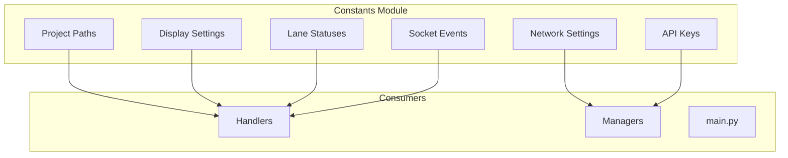
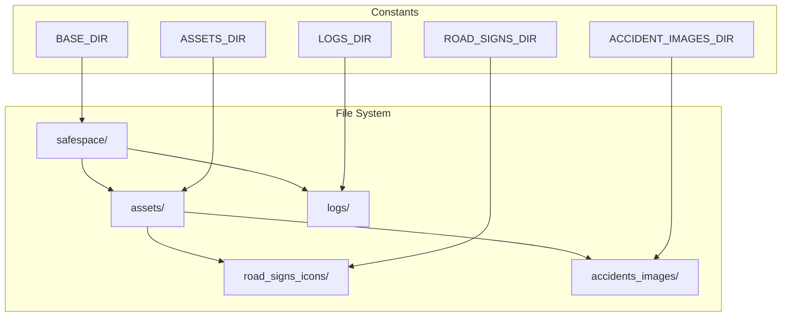
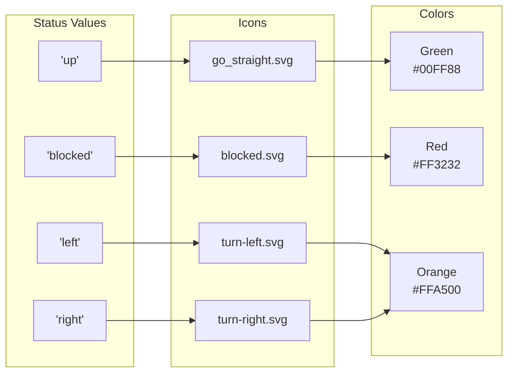

# Constants Utility

The Constants module defines global constants, paths, and configuration defaults used throughout the Safespace Node application.

## Overview



## Constants Reference

### Project Structure

```python
from pathlib import Path

BASE_DIR = Path(__file__).parent.parent
ASSETS_DIR = BASE_DIR / "assets"
LOGS_DIR = BASE_DIR / "logs"
```

| Constant | Value | Description |
|----------|-------|-------------|
| `BASE_DIR` | `safespace/` | Project root directory |
| `ASSETS_DIR` | `safespace/assets/` | Static assets directory |
| `LOGS_DIR` | `safespace/logs/` | Log files directory |

### Asset Paths

```python
ROAD_SIGNS_DIR = ASSETS_DIR / "road_signs_icons"
ACCIDENT_IMAGES_DIR = ASSETS_DIR / "accidents_images"
DEFAULT_ACCIDENT_IMAGE = ACCIDENT_IMAGES_DIR / "accident.png"
```

| Constant | Path | Description |
|----------|------|-------------|
| `ROAD_SIGNS_DIR` | `assets/road_signs_icons/` | Lane status SVG icons |
| `ACCIDENT_IMAGES_DIR` | `assets/accidents_images/` | Saved accident snapshots |
| `DEFAULT_ACCIDENT_IMAGE` | `assets/accidents_images/accident.png` | Fallback image |

### Display Settings

```python
DEFAULT_WINDOW_WIDTH = 1500
DEFAULT_WINDOW_HEIGHT = 856
ASPECT_RATIO = 16 / 9
MIN_WINDOW_WIDTH = 960
MIN_WINDOW_HEIGHT = 540
```

| Constant | Value | Description |
|----------|-------|-------------|
| `DEFAULT_WINDOW_WIDTH` | 1500 | Default window width in pixels |
| `DEFAULT_WINDOW_HEIGHT` | 856 | Default window height in pixels |
| `ASPECT_RATIO` | 1.778 (16:9) | Window aspect ratio |
| `MIN_WINDOW_WIDTH` | 960 | Minimum window width |
| `MIN_WINDOW_HEIGHT` | 540 | Minimum window height |

### Network Settings

```python
DEFAULT_HEARTBEAT_INTERVAL = 30
DEFAULT_SERVER_URL = "http://localhost:5000"
CONNECTION_TIMEOUT = 10
```

| Constant | Value | Description |
|----------|-------|-------------|
| `DEFAULT_HEARTBEAT_INTERVAL` | 30 | Seconds between heartbeats |
| `DEFAULT_SERVER_URL` | `http://localhost:5000` | Default Central Unit URL |
| `CONNECTION_TIMEOUT` | 10 | Connection timeout in seconds |

### Lane Statuses

```python
LANE_STATUS_UP = "up"
LANE_STATUS_BLOCKED = "blocked"
LANE_STATUS_LEFT = "left"
LANE_STATUS_RIGHT = "right"
```

| Constant | Value | Icon | Description |
|----------|-------|------|-------------|
| `LANE_STATUS_UP` | "up" | ⬆️ | Lane open, go straight |
| `LANE_STATUS_BLOCKED` | "blocked" | ❌ | Lane closed |
| `LANE_STATUS_LEFT` | "left" | ⬅️ | Divert left |
| `LANE_STATUS_RIGHT` | "right" | ➡️ | Divert right |

### Socket.IO Events

```python
EVENT_ROAD_UPDATE = "road_update"
EVENT_CENTRAL_UNIT_UPDATE = "central_unit_update"
EVENT_HEARTBEAT = "heartbeat"
EVENT_ACCIDENT_REPORT = "/api/accident-detected"
```

| Constant | Value | Direction | Description |
|----------|-------|-----------|-------------|
| `EVENT_ROAD_UPDATE` | "road_update" | Server → Node | Road state change |
| `EVENT_CENTRAL_UNIT_UPDATE` | "central_unit_update" | Server → Node | Admin instruction |
| `EVENT_HEARTBEAT` | "heartbeat" | Node → Server | Keep-alive signal |
| `EVENT_ACCIDENT_REPORT` | "/api/accident-detected" | Node → Server | HTTP endpoint |

### API Keys

```python
import os
ROBOFLOW_API_KEY = os.environ.get("ROBOFLOW_API_KEY")
```

| Constant | Source | Description |
|----------|--------|-------------|
| `ROBOFLOW_API_KEY` | Environment | Roboflow API key (optional) |

## Directory Structure



## Lane Status Visual Mapping



## Usage Examples

### Path Usage

```python
from utils.constants import ACCIDENT_IMAGES_DIR, ROAD_SIGNS_DIR

# Save snapshot
save_path = ACCIDENT_IMAGES_DIR / f"accident_{timestamp}.jpg"

# Load icon
icon_path = ROAD_SIGNS_DIR / "blocked.svg"
```

### Display Constants

```python
from utils.constants import (
    DEFAULT_WINDOW_WIDTH, DEFAULT_WINDOW_HEIGHT,
    MIN_WINDOW_WIDTH, MIN_WINDOW_HEIGHT, ASPECT_RATIO
)

self.setGeometry(0, 0, DEFAULT_WINDOW_WIDTH, DEFAULT_WINDOW_HEIGHT)
self.setMinimumSize(MIN_WINDOW_WIDTH, MIN_WINDOW_HEIGHT)
```

### Lane Status Usage

```python
from utils.constants import (
    LANE_STATUS_UP, LANE_STATUS_BLOCKED,
    LANE_STATUS_LEFT, LANE_STATUS_RIGHT
)

# Update lane display
if accident_in_lane:
    display.update_lane(lane_index, LANE_STATUS_BLOCKED)
else:
    display.update_lane(lane_index, LANE_STATUS_UP)
```

### Network Events

```python
from utils.constants import (
    EVENT_ROAD_UPDATE, EVENT_HEARTBEAT, EVENT_ACCIDENT_REPORT
)

# Setup event handler
@sio.on(EVENT_ROAD_UPDATE)
def handle_road_update(data):
    process_update(data)

# Emit heartbeat
sio.emit(EVENT_HEARTBEAT, {'nodeId': node_id})

# POST accident
requests.post(f"{server_url}{EVENT_ACCIDENT_REPORT}", data=payload)
```

## Benefits

1. **Centralized Values** - Single source of truth
2. **Easy Maintenance** - Change once, update everywhere
3. **IDE Support** - Autocomplete and type hints
4. **No Magic Strings** - Avoid typos and inconsistencies
5. **Documentation** - Self-documenting code

## Related Components

- [Display Handler](../handlers/display_handler.md) - Uses display constants
- [Socket Handler](../handlers/socket_handler.md) - Uses event constants
- [IO Manager](../managers/io_manager.md) - Uses path constants
- [Config](config.md) - Provides additional settings
