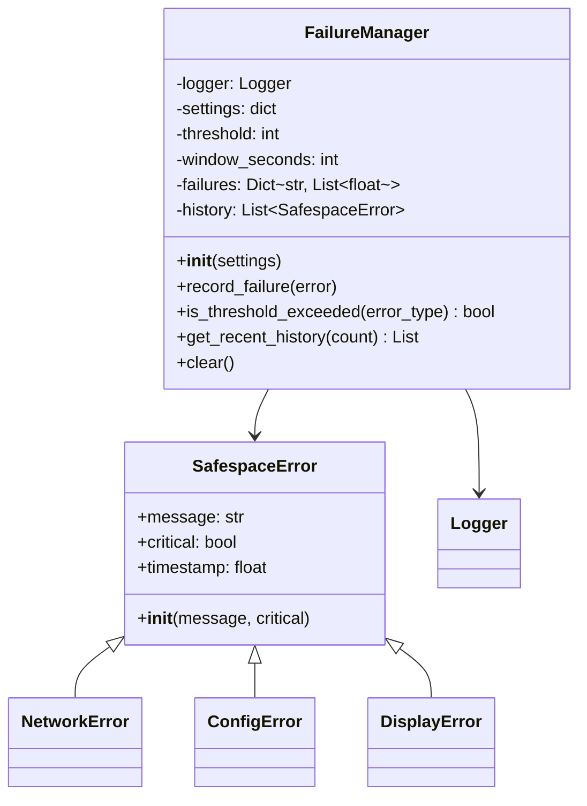
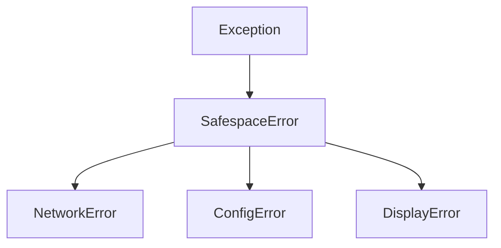
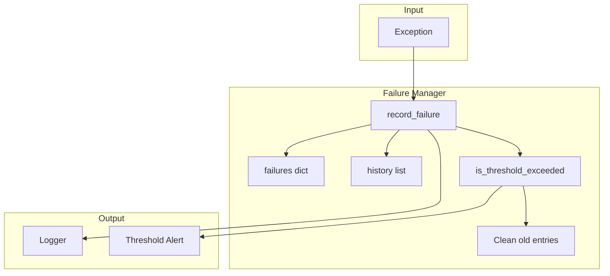
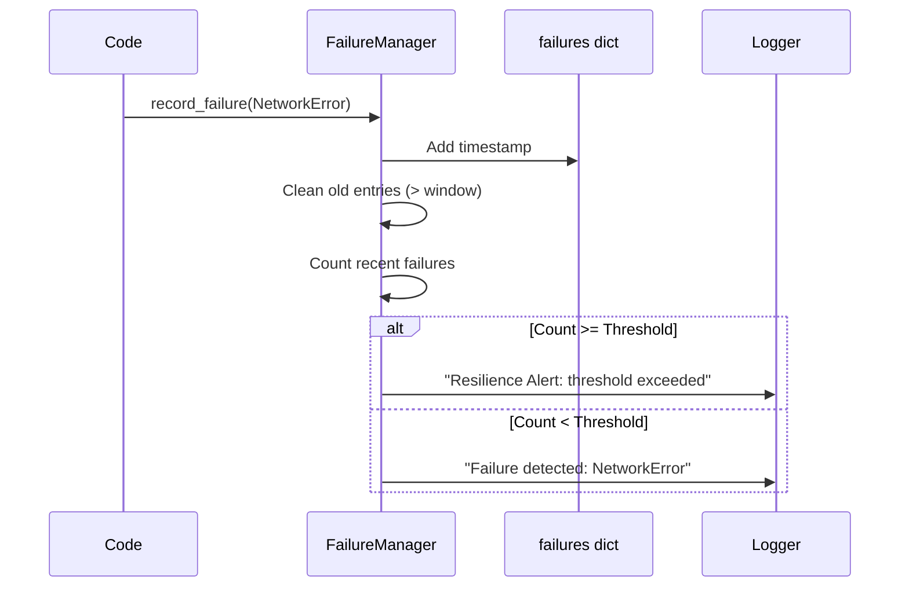
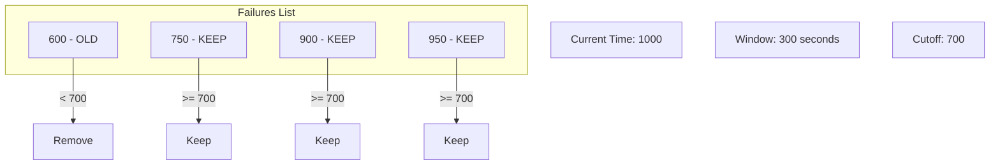
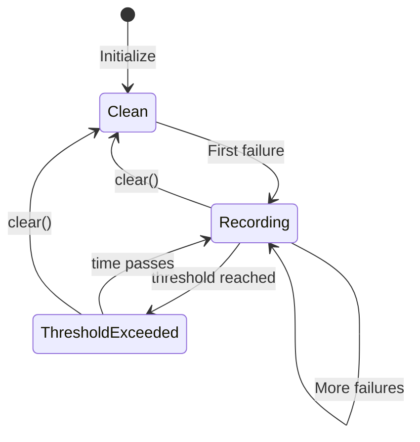
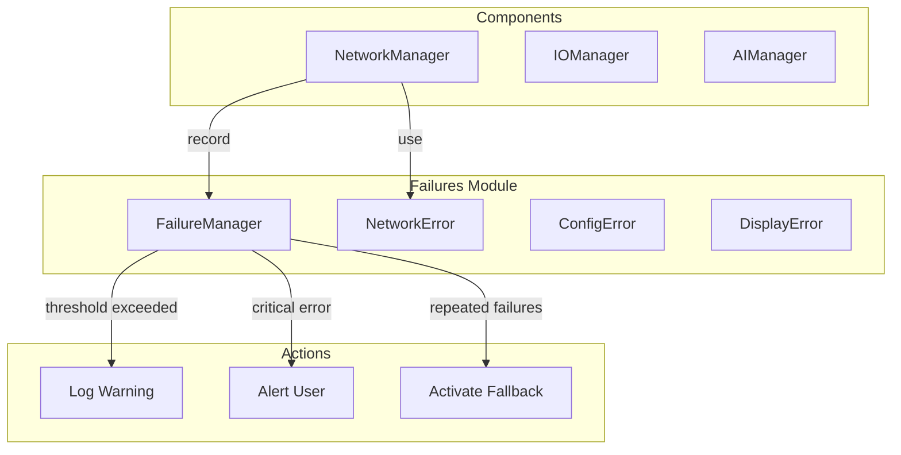

# Failures Utility

The Failures module provides structured error handling and failure tracking for building resilient applications that can detect recurring issues.

## Overview



## Purpose

The Failures module provides:

1. **Custom Exceptions** - Domain-specific error types
2. **Failure Tracking** - Record and count failures over time
3. **Threshold Detection** - Alert when failures become too frequent
4. **Error History** - Maintain a log of recent failures
5. **Resilience Monitoring** - Identify systemic issues

## Exception Hierarchy



### SafespaceError (Base)

```python
class SafespaceError(Exception):
    def __init__(self, message: str, critical: bool = False):
        self.message = message
        self.critical = critical
        self.timestamp = time.time()
```

| Attribute | Type | Description |
|-----------|------|-------------|
| `message` | str | Error description |
| `critical` | bool | Whether error is system-critical |
| `timestamp` | float | Unix timestamp when error occurred |

### NetworkError

For network-related failures:
- Connection failures
- Timeout errors
- Upload failures
- Heartbeat failures

### ConfigError

For configuration-related failures:
- Missing config files
- Invalid JSON
- Missing required keys

### DisplayError

For GUI-related failures:
- Widget creation errors
- Rendering issues

## FailureManager

### Configuration

```json
{
  "failures": {
    "threshold": 5,
    "window_seconds": 300
  }
}
```

| Setting | Default | Description |
|---------|---------|-------------|
| `threshold` | 5 | Number of failures to trigger alert |
| `window_seconds` | 300 | Time window for counting failures (5 min) |

### Architecture



## API Reference

### Constructor

```python
def __init__(self, settings: Optional[dict] = None)
```

**Parameters:**
- `settings`: Dictionary with `threshold` and `window_seconds`

### Methods

#### `record_failure(error: Exception)`

Records a failure and checks threshold.

```python
manager = FailureManager({'threshold': 5, 'window_seconds': 300})

try:
    connect_to_server()
except Exception as e:
    manager.record_failure(NetworkError(f"Connection failed: {e}"))
```

---

#### `is_threshold_exceeded(error_type: str) -> bool`

Checks if a specific error type has exceeded the threshold.

```python
if manager.is_threshold_exceeded("NetworkError"):
    print("Too many network errors - consider fallback!")
```

---

#### `get_recent_history(count: int = 10) -> List[SafespaceError]`

Returns the most recent failures.

```python
recent = manager.get_recent_history(5)
for error in recent:
    print(f"{error.timestamp}: {error.message}")
```

---

#### `clear()`

Resets all tracked failures.

```python
manager.clear()
```

## Threshold Detection



### Time Window Cleanup



## Usage Examples

### Basic Usage

```python
from utils.failures import FailureManager, NetworkError

# Initialize
failures = FailureManager({'threshold': 3, 'window_seconds': 60})

# Record failures
failures.record_failure(NetworkError("Connection refused"))
failures.record_failure(NetworkError("Timeout"))
failures.record_failure(NetworkError("Connection refused"))

# Check threshold
if failures.is_threshold_exceeded("NetworkError"):
    switch_to_offline_mode()
```

### With Critical Errors

```python
from utils.failures import NetworkError

# Non-critical error
error = NetworkError("Heartbeat failed")
failures.record_failure(error)

# Critical error
critical_error = NetworkError("All connections lost", critical=True)
failures.record_failure(critical_error)
```

### In Network Manager

```python
class NetworkManager:
    def __init__(self, config):
        self.failures = FailureManager(config.get('failures', {}))
    
    def start(self):
        try:
            if not self.socket.connect():
                raise NetworkError("Initial connection failed", critical=True)
        except NetworkError as e:
            self.failures.record_failure(e)
            return False
        return True
    
    def _heartbeat_loop(self):
        while self.active:
            try:
                self.socket.emit_heartbeat(self.node_id)
            except Exception as e:
                self.failures.record_failure(
                    NetworkError(f"Heartbeat failed: {e}")
                )
            time.sleep(30)
```

## Failure Tracking State



## Integration Pattern



## Benefits

1. **Structured Errors** - Categorized, typed exceptions
2. **Temporal Analysis** - Detect recurring issues
3. **Automatic Cleanup** - Old failures are removed
4. **Resilience Alerts** - Early warning for systemic problems
5. **Debug History** - Track recent failures for investigation

## Related Components

- [Network Manager](../managers/network_manager.md) - Primary consumer
- [Logger](logger.md) - Failure logging
- [Config](config.md) - Failure settings
