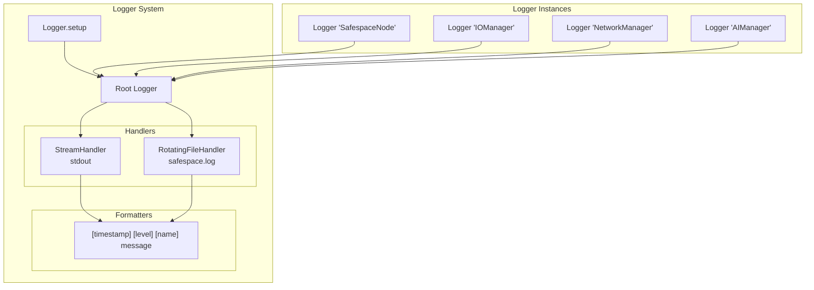
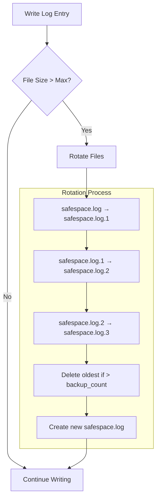
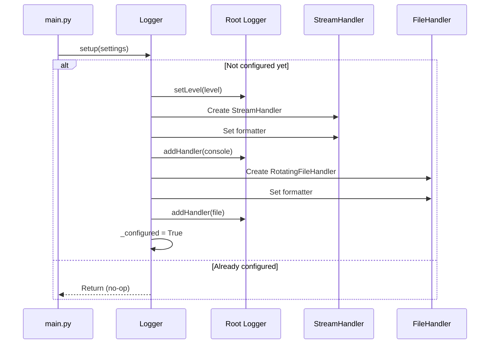
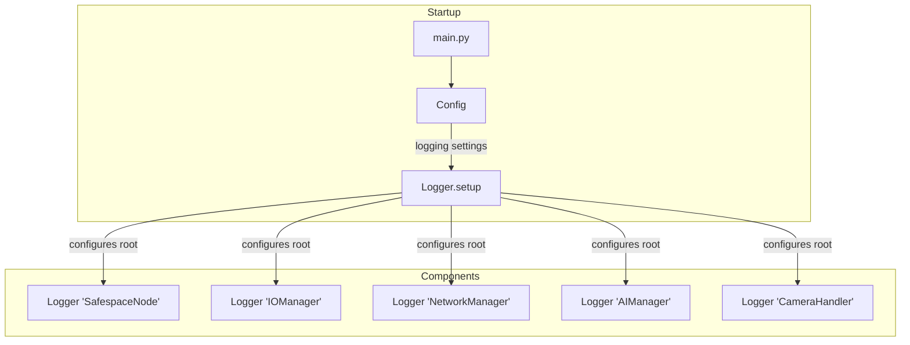

# Logger Utility

The Logger utility provides enhanced logging capabilities with console and rotating file output for the Safespace Node application.

## Overview

```mermaid
classDiagram
    class Logger {
        -logger: logging.Logger
        -_configured: bool$
        +setup(settings: dict)$
        +__init__(name: str)
        +info(message: str)
        +warning(message: str)
        +error(message: str)
        +debug(message: str)
        +critical(message: str)
    }
    
    Logger --> "logging.Logger"
    Logger --> "RotatingFileHandler"
    Logger --> "StreamHandler"
```

## Purpose

The Logger utility provides:

1. **Console Output** - Colorful, formatted terminal logging
2. **File Rotation** - Automatic log file rotation when size limit reached
3. **Named Loggers** - Component-specific logging namespaces
4. **Configurable Levels** - DEBUG, INFO, WARNING, ERROR, CRITICAL
5. **Singleton Setup** - Global configuration applied once

## Architecture



## Configuration

### logging.json Structure

```json
{
  "logging": {
    "level": "INFO",
    "rotation": "5MB",
    "backup_count": 5
  }
}
```

### Configuration Fields

| Field | Type | Default | Description |
|-------|------|---------|-------------|
| `level` | string | "INFO" | Minimum log level |
| `rotation` | string | "5MB" | Max file size before rotation |
| `backup_count` | int | 5 | Number of backup files to keep |

### Log Levels

| Level | Value | Description |
|-------|-------|-------------|
| DEBUG | 10 | Detailed debugging information |
| INFO | 20 | General operational messages |
| WARNING | 30 | Warning conditions |
| ERROR | 40 | Error conditions |
| CRITICAL | 50 | Critical failures |

## API Reference

### Class Methods

#### `Logger.setup(settings: dict)`

Configures global logging (called once at startup).

```python
Logger.setup({
    'level': 'DEBUG',
    'rotation': '10MB',
    'backup_count': 3
})
```

**Parameters:**
- `settings`: Dictionary with logging configuration

### Instance Methods

#### Constructor

```python
def __init__(self, name: str = "Safespace")
```

Creates a named logger instance.

```python
logger = Logger("MyComponent")
```

---

#### Logging Methods

```python
logger.debug("Detailed debug info")
logger.info("Normal operation message")
logger.warning("Warning condition detected")
logger.error("Error occurred")
logger.critical("Critical failure!")
```

## Log Format

```
[2026-02-05 14:30:45] [INFO] [SafespaceNode] Initializing Safespace Node...
```

| Component | Description |
|-----------|-------------|
| `[2026-02-05 14:30:45]` | Timestamp |
| `[INFO]` | Log level |
| `[SafespaceNode]` | Logger name |
| `Initializing...` | Message |

## File Rotation



### Rotation Size Formats

| Format | Size |
|--------|------|
| `"5MB"` | 5 × 1024 × 1024 = 5,242,880 bytes |
| `"10MB"` | 10 × 1024 × 1024 = 10,485,760 bytes |
| `"500KB"` | 500 × 1024 = 512,000 bytes |

## Log Files Location

```
safespace/logs/
├── safespace.log      # Current log file
├── safespace.log.1    # Previous log
├── safespace.log.2    # Older log
├── safespace.log.3    # Even older
└── ...
```

## Setup Flow



## Usage Example

```python
from utils.logger import Logger

# 1. Global setup (once, typically in main.py)
Logger.setup({
    'level': 'DEBUG',
    'rotation': '5MB',
    'backup_count': 5
})

# 2. Create logger instances
logger = Logger("MyComponent")

# 3. Log messages
logger.debug("Starting processing...")
logger.info("Connected to server")
logger.warning("Retrying connection...")
logger.error("Failed to connect after 3 retries")
logger.critical("System cannot continue!")
```

## Output Examples

### Console Output
```
[2026-02-05 14:30:45] [INFO] [SafespaceNode] Initializing Safespace Node...
[2026-02-05 14:30:45] [INFO] [IOManager] Starting IO components...
[2026-02-05 14:30:46] [INFO] [NetworkManager] Connecting to Central Unit...
[2026-02-05 14:30:46] [WARNING] [CameraHandler] Captured empty frame, retrying...
[2026-02-05 14:30:47] [ERROR] [AIManager] Failed to load model: invalid path
```

### File Output
Same format, written to `safespace/logs/safespace.log`

## Integration Pattern



## Error Handling

| Scenario | Behavior |
|----------|----------|
| Invalid level | Falls back to INFO |
| Log dir not writable | File handler skipped |
| Invalid rotation format | Uses default 5MB |
| Setup called twice | Second call is ignored |

## Best Practices

1. **Call setup() once** at application startup
2. **Use descriptive names** for logger instances
3. **Choose appropriate levels**:
   - `debug`: Development details
   - `info`: Normal operations
   - `warning`: Recoverable issues
   - `error`: Failures that need attention
   - `critical`: System-breaking failures

## Related Components

- [Config](config.md) - Provides logging settings
- [All Components](../) - Logger consumers
